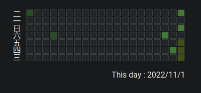

# 可以使用纯CSS实现Tooltip

原理是使用`:after`,`:before`伪类和`:hover`来动态添加内容。Tooltip的内容可以使用`content:attr()`来获取。

具体实现:

```css
.tooltip {
    /* 确定Tooltip的位置 */
    position: relative;
}

.tooltip:hover:after {
    /* 获取标签的内容 */
    content: attr(data-tooltip);
    background: #000;
    color: #FFF;
    text-align: center;
    border-radius: 3px;
    padding: 5px;
    display: inline-block;
    /* 保持在目标上方 */
    position: absolute;
    transform: translate(-50%, -100%);
    /* 保持居中 */
    left: 50%;
}

```

这个Tooltip类可以加载几乎任何html标签上。比如一个普通的文字：

```html

<small class="tooltip" data-tooltip="this is sample tooltip" id="quota">
    Last Generate : Wed Nov 30 10:17:19 PM  CST 2022
</small>

```

结果就会是这样：



*参考：MDN上的示例:https://developer.mozilla.org/en-US/docs/Web/CSS/::after*(~~比较难看的Tooltip~~)