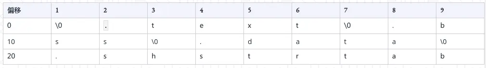

> 「所谓文件就是一大袋子字节，而它的含义则取决于程序怎么解释它。」

# ELF 文件

ELF 的全称是「Executable and Linkable Format」。是最常见的可执行文件格式。其源自于 SystemV UNIX R3 版本的 COFF 格式，后来微软基于 COFF 发展了 PE 格式，SystemV UNIX R4 基于 COFF 发展了 ELF 格式。

ELF 文件也就是一个普通的文件。它包含一个文件头和若干个段。段的数量是任意的，头只能用一个。每个段都有一个字符串名称，一般以「.」开头的段名称，诸如 `.text`, `.bss` 等是编辑器保留的名称。所有的段名对于操作系统来讲没有意义，只有这些段的属性，诸如「可执行」，「只读」等有意义。

要解析 ELF 格式，其目标实际上就是精确的得到各个段的位置和它们的名字。

# 读取和解析 ELF 文件

读取 ELF 文件需要获得几个重要的结构，此处以 x86-64 系统为例，需要获取的分别是 ELF 文件头，保存该文件所以段的信息（不是段本身的内容）的数组，以及保存段表字符串表的字符数组。其中：

- ELF 文件头。
  
  结构名称为 `Elf64_Ehdr`。每一个 ELF 文件只有一个。保存了关于这个文件的属性信息，和用来定位段表位置的 `e_phentsize` 和用来获取段表字符串表在段表中的下标的 `e_shstrndx`。

  ```c
    typedef struct
    {
        unsigned char	e_ident[EI_NIDENT];	/* Magic number and other info */
        Elf64_Half	e_type;			/* Object file type */
        Elf64_Half	e_machine;		/* Architecture */
        Elf64_Word	e_version;		/* Object file version */
        Elf64_Addr	e_entry;		/* Entry point virtual address */
        Elf64_Off	e_phoff;		/* Program header table file offset */
        Elf64_Off	e_shoff;		/* Section header table file offset */
        Elf64_Word	e_flags;		/* Processor-specific flags */
        Elf64_Half	e_ehsize;		/* ELF header size in bytes */
        Elf64_Half	e_phentsize;		/* Program header table entry size */
        Elf64_Half	e_phnum;		/* Program header table entry count */
        Elf64_Half	e_shentsize;		/* Section header table entry size */
        Elf64_Half	e_shnum;		/* Section header table entry count */
        Elf64_Half	e_shstrndx;		/* Section header string table index */
    } Elf64_Ehdr;
  ```

  读取方式可以是：

  ```c
  Elf64_Ehdr *header = (Elf64_Ehdr *)malloc(sizeof(Elf64_Ehdr));
  fread(header, sizeof(Elf64_Ehdr), 1, fp_elf);
  ```

- 段表。
  
  段表是一个 `Elf64_Shdr` 构成的数组。每一个元素保存了这个段在文件中的偏移，以及这个段的属性。其中 `sh_name` 是用来定位这个段的名字在段表字符串表中的下标。这个段表的偏移在文件头中，大小可以用「每段长度 * 段的数量」确定。两者都在文件头中给出。

    ```c
    typedef struct {
        Elf64_Word	sh_name;		/* Section name (string tbl index) */
        Elf64_Word	sh_type;		/* Section type */
        Elf64_Xword	sh_flags;		/* Section flags */
        Elf64_Addr	sh_addr;		/* Section virtual addr at execution */
        Elf64_Off	sh_offset;		/* Section file offset */
        Elf64_Xword	sh_size;		/* Section size in bytes */
        Elf64_Word	sh_link;		/* Link to another section */
        Elf64_Word	sh_info;		/* Additional section information */
        Elf64_Xword	sh_addralign;		/* Section alignment */
        Elf64_Xword	sh_entsize;		/* Entry size if section holds table */
    } Elf64_Shdr;
    ```

    获取整个段表可以是：

    ```c
    Elf_Shdr *section_table = malloc(header.e_shnum * sizeof(Elf64_Shdr) );
    fseek(file, header.e_shoff, 0);
    fread(section_table, sizeof(Elf64_Shdr),
            header.e_shnum, file);
    ```

    **注意**：段表的第一项所有项目都是 NULL 。

- 段表字符串表
  
  段表字符串表是保存所有段的名称字符串的单独段，假设一个 ELF 文件有 `.text`，`.bss`，`.data` 三个段（不包括段表和段表字符串表），那么段表字符串表的内容可以是：

    

    那么，`.text` 在段表中的数据中 `sh_name` 的指向就是 2 ，即等宽的那一项。它的段名一直到最近的 「\0」。

    要获取段表字符串表，直接在段表中找到对应下标的项目即可。这个下标也就是文件头中的 `e_shstrndx`。

# 使用 readelf 工具

可以直接使用 `readelf` 工具打印出 ELF 文件的信息。一般使用 `-S` 参数，打印出所有段的信息，起始位置等等。