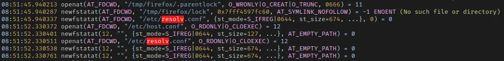

**TL；DR**：直接在 `/etc/hosts` 里增加一行记录，把本机主机名指向 `127.0.0.1` 即可。

一般 Linux 发行版的默认浏览器都是 Firefox, 但是我在 openSUSE 上的 Firefox 启动每一次都需要很久，而且每次等待的时间还不一样，多则 10 秒，少则 3-4 秒，很是折磨人。这个问题之前用其他发行版的时候都遇到过，可以确定不是操作系统的原因，我不想因为这个原因就放弃 Firefox 使用 Chrome，所以打算彻底调查一下问题的原因。

首先我尝试着使用安全模式打开 Firefox, 在命令行启动时加上 `--safe-mode`, 但是依旧没有效果，所以可以排除是扩展插件的问题。我遂怀疑是 Firefox 在寻找某个文件的时候出了故障，用 `strace` 追踪一下系统调用，加上时间戳，找到间隔好几秒的断层，看看它到底在访问什么文件：

```shell
strace -tt -o log2 -e trace=file firefox
```

`-tt` 是加上时间戳，`-o` 输出为文件，`-e trace=` 增加过滤器。

结果发现了这个：



Firefox 在尝试访问 `/etc/resolv.conf` 这个文件。但是系统调用是成功的，而且我查看文件内容也没有毛病。这个文件本身是本机 DNS 解析的配置文件，Firefox 访问它想必和 DNS 解析有些关系。那么我想用可能是因为 Firefox 试图访问一个被墙了的网站，超时导致延迟。那么就要捕获所有的 DNS 解析尝试，我想到了使用 `proxychain`.

虽然 `proxychain` 是一个代理工具，但是它会在控制台显示被代理的程序的互联网访问记录，我尝试了一下，可是一无所获。

上网搜索了一下，发现有一位仁兄在 8 年前于 Bugzilla 上提了一个差不多的问题，标号是 [Bug 1189705](https://bugzilla.mozilla.org/show_bug.cgi?id=1189705). 他的分析是，Firefox 启动时会对本机进行一次 DNS 查询，导致超时。所以按照这个思路，我只需要过滤出所有的网络相关系统调用，看看有没有我自己的主机名即可：

```shell
strace -o log -e trace=network firefox 
```

自己的主机名称在 `/etc/hostname`，过滤可以看到：


**果然**。

那么，只要让 DNS 访问直接指向本机即可，解决方案很简单，直接在 `/etc/hosts` 里增加一行记录，把本机主机名指向 `127.0.0.1` 即可。再次尝试打开 Firefox, 启动速度稳定保持在 2 秒左右。

现在想起来，应该是自己自定义主机名时，把原来主机名后面的 `.localhost` 去掉了，导致 DNS 解析不出来。