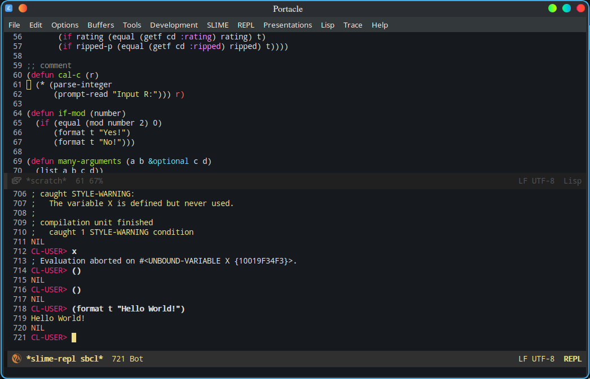
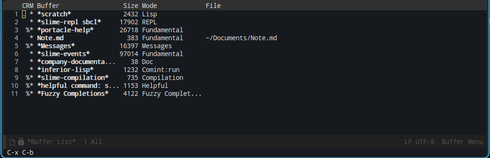
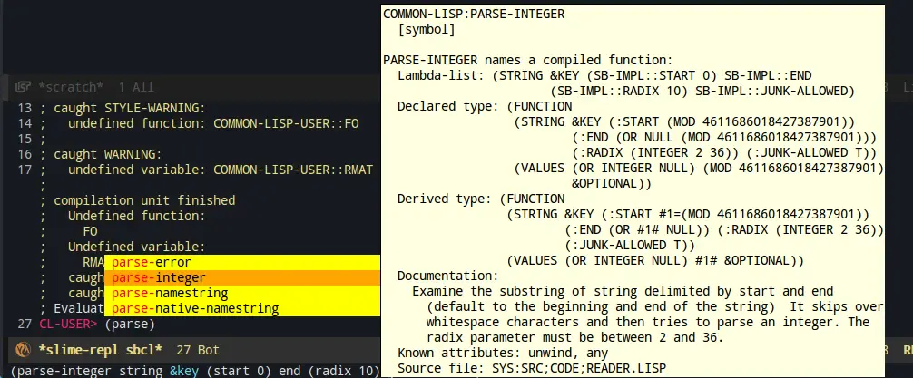
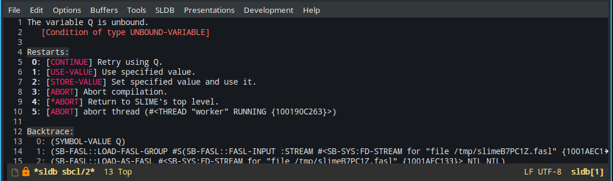

Portacle 是一个 CommonLisp 运行时和开发环境，没有复杂的安装流程，更没有附带各种恶心限制的许可证(<del>说的就是你 LispWorks</del>)，使用方便。基于 Emacs 构建，自带 SBCL，busybox，Quicklisp，git，SLIME。

# 安装配置

在[官方网站](https://portacle.github.io)下载 tar.xz 包，然后解压到希望安装的目录下。运行即可。加载配置文件需要一小会儿，之后就能看见主界面了。

第一次运行需要先进行用户配置，按 `Alt + X` 输入 `portacle-configure` 回车，按照提示进行初次配置。



主界面默认上下分栏，上面的是 `scratch` 区域，用来编辑运行环境里面的 Lisp 代码，下面的是 `slime-repl`，用来和 Lisp 解释器交互。Portacle 有一个现代 IDE 应该有的功能，包括自动补全，文档提示，自动格式化代码，错误提示等等。

# 基本操作

由于 Portacle 是基于 Emacs 的，所以掌握 Emacs 的基本操作也就是掌握 Portacle 的基本操作。

## Emacs 相关

按照一般的写法，`Ctrl + 按键` 就写成 `C-按键`，`Meta + 按键` 就写成 `M-按键`。在标准键盘上，Meta 键就是 `Alt` 键。

如果你键入一半的快捷键不想操作了，狠狠的摁几下 `C-g` 即可。

### 光标操作

| 键位  |            操作             |
| :---: | :-------------------------: |
| `C-p` |        光标向上移动         |
| `C-n` |        光标向下移动         |
| `C-b` |        光标向左移动         |
| `C-f` |        光标向右移动         |
| `M-f` |        向前跳一个字         |
| `M-b` |        向后跳一个字         |
| `C-a` |         到一行开头          |
| `C-e` |         到一行结尾          |
| `M-a` | 到段落开头(函数/宏定义开头) |
| `M-e` | 到段落结尾(函数/宏定义结尾) |
| `C-v` |          向下一页           |
| `M-v` |          向上一页           |

### 撤销重做

|  键位   |      操作      |
| :-----: | :------------: |
| `C-x u` | 撤销上一个行为 |

### 删除

被按行/句为单位删除的会被保留在剪切环中，之后可以取回来。

|     键位      |      操作      |
| :-----------: | :------------: |
|     `C-d`     |   删除一个字   |
| `M-Backspace` | 向后删除一个词 |
|     `M-d`     | 向前删除一个词 |
|     `C-k`     |   删除到行尾   |
|     `M-k`     |   删除到句点   |

### 复制粘贴

- 对于删除掉的保存在剪贴环中的内容，使用 `C-y` 取得。

- 使用以下操作进行任意选区的复制粘贴：
  
  1. `C-Shift-2` 进入 `Mark` 模式；
  
  2. 移动光标选取需要的内容；
  
  3. `M-w` 复制到剪贴环；
  
  4. `C-y` 粘贴。
     
     也可以直接使用鼠标选取区域。

### 在 buff 之间切换

可以把 buff 理解成是标签页，一个 Emacs 可以打开很多 buff，你需要在不同的 buff 之间辗转挪移。



|          键位           |                         操作                         |
| :---------------------: | :--------------------------------------------------: |
|      `C-x b name`       |                   创建一个空 buff                    |
|    `C-x left/right`     | 上一个/下一个 buff，left 和 right 就是小键盘的方向键 |
|        `C-x C-b`        |                    列出所有 buff                     |
|        `C-x C-q`        |               设置这个 buff 的只读状态               |
|         `C-x k`         |                      关闭 buff                       |
| `M-x kill-some-buffers` |                交互式的一个个提示关闭                |

### 文件操作

你在 scratch 里面的文件虽然加载到了 Lisp 环境里面，但并没有保存！

|   键位    |           操作           |
| :-------: | :----------------------: |
| `C-x C-f` |       打开一个文件       |
| `C-x C-s` |       **保存文件**       |
|  `C-x i`  | 在光标处插入指定文件内容 |
|  `C-x s`  |         全部保存         |

另外，如果你要直接载入 Lisp 代码，需要在 Slime 里面执行：

`(load xxx.lisp)` 来载入代码。

另一种加载文件的方法是，先用 COMPILE-FILE 编译，然后再用 LOAD 加载编译后产生
的文件,也就是 FASL 文件。前者将返回 FASL 文件的名字,所以可以在 REPL 进行编译加载:

```lisp
(load (compile-file "hello.lisp"))
;;; Compiling file hello.lisp
;;; Writing fasl file hello.fasl
;;; Fasl write complete
; Fast loading /home/xxxx/my-lisp-programs/hello.fasl
```

最后，在一个源代码缓冲区的时候,可以使用 `C-c C-l` 调用命令 `slime-load-file` 来加载文件。Emacs 将会提示你给出要加载的文件名,同时将当前的文件名作为默认值，直接回车就可以了。

### 搜索和替换

|    键位     |        操作        |
| :---------: | :----------------: |
|    `C-r`    |    光标向上移动    |
|    `C-s`    |      向前搜索      |
|    `C-g`    |      向后搜索      |
|  `C-x C-x`  | 回到搜索执行的地方 |
| `M-Shift-5` |     交互式替换     |

## SLIME 相关

默认下面的 buff 就是 slime 的 repl，你可以在这里执行 lisp 。**注意，这个 lisp 不是 Emacs 内置的 EmacsLisp，而是 CommonLisp**！

**repl 中使用 `C-<up>` `C-<down>` 来编辑历史命令！**

### slime-selector

这个 slime-selector 可以快捷的在各个不同的 slime buff 之间跳转，相当于是给各个 buff 定义了快捷键。默认情况不绑定，需要手动绑定以下。

打开按照目录的 `config/user.el` 在最后加上按键绑定 `(global-set-key "\C-cs" 'slime-selector)` 之后重启即可，之后就可以使用 `C-c s <按键>` 来快捷到达某个 buff。

常见的选项：

- ?
    查看帮助

- r
    进入 SLIME 的 repl buff，也就是默认界面下面的 buff

- d
    最近一次激活的 debugger buff

- l
    最近一次访问的 lisp-mode 源码 buff.

- s
    *slime-scratch* buffer，也就是默认界面上面的那个 buff

所以，在任何时候想要去 repl 只要 `C-c s r` 即可。

### 执行

|   键位    |      操作      |
| :-------: | :------------: |
| `C-x C-e` | 执行上一个语句 |

### 编译

|   键位    |                操作                |
| :-------: | :--------------------------------: |
| `C-c C-c` | 编译函数，被编译的对象会被高亮显示 |
| `C-c C-l` |              加载文件              |
| `C-c C-k` |           加载并编译文件           |

### 寻找定义

|   键位    |             操作             |
| :-------: | :--------------------------: |
|   `M-.`   | 跳转到目前光标所在位置的定义 |
|   `M-,`   |       返回寻找时的位置       |
| `C-x 4 .` |   打开新的窗口编辑目标定义   |

### 获取文档



|    键位     |       操作       |
| :---------: | :--------------: |
| `C-c C-d d` | 描述光标处的定义 |
| `C-c C-d A` |  slime-apropos   |

### 错误处理



有时候你的 Lisp 代码出错了，Slime 会打开一个临时 buff 来处理出错，你可以直接按 `q` 关闭这个 buff。

# 其他问题

中文字体似乎很是难看，我尝试了这样配置：

```elisp
(set-fontset-font t '(#x2ff0 . #x9ffc) 
    (font-spec :family "Sarasa Mono Slab SC" :size 18 :weight 'bold))
```

但是无效:-(


# 参见

- [SLIME User Manual, version 2.24](https://mirrors.sjtug.sjtu.edu.cn/emacs-elpa/nongnu-devel/doc/slime.html)
- [Emacs 使用手册](https://scc.ustc.edu.cn/zlsc/czxt/200910/W020100308601210472906.pdf)
- [Portacle 网站](https://portacle.github.io)