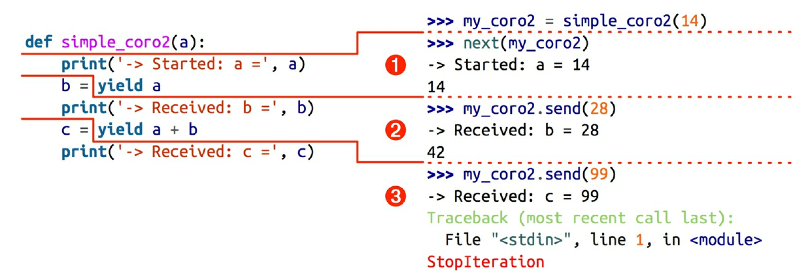
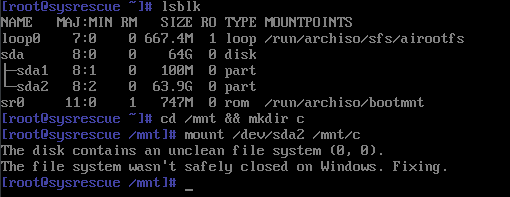

「协程」看它的名字不是个很好理解的词语，其英文 Coroutine 的定义是「Computer program components that generalize subroutines for non-preemptive multitasking, by allowing execution to be suspended and resumed.」它与普通的子例程的区别在于「allowing execution to be suspended and resumed」，通俗的来讲，就是一个「可以暂停和恢复的，同时能够保存一些信息的子例程」。在 Python 中，`yield`，`yield from`，`async`，`await` 关键字都能够用来做协程处理。

# 基本行为

一个协程基本上是一个特殊的函数，不过与普通的函数不同，协程可以保存内部的状态，将控制流程转移出去，同时在运行时接收外界进一步的信息。假如有函数 `a`，`b` 和协程 `c`，那么控制流程可以是这样的：

```erlang
main -> a -> b -> done
// 按照次序调用 a 和 b，在 a 和 b 运行的过程中并不能打断

main -> c -> main -> c -> main -> done
// 调用 c 运行到其内部的 yield 时保存内部状态，控制器还给调用者
```

举例来说明:

```python
def coro():
    yield 1
    yield 2
    yield 3

a = coro()
print(a.__next__())
print(a.__next__())
print(a.__next__())
print(a.__next__()) # Exception !
```

在这个简单的例子中，`coro` 只是按照次序返回 1，2，3。其实，a 的类型是一个 `Generator[Literal[1, 2, 3], None, None]`，也就是生成器类型。使用其 `__next__` 方法，或者调用 `next(a)` 可以获得一个值，同时协程返还控制权，直到所以值被消耗完毕，抛出 `StopIteration` 异常为止。

协程和普通函数最大的区别在于其不使用 `return` 而是使用 `yield`，说句老实话，我觉得「协程」这个词倒不如换成「yield 函数」之类的说法，<del>当然语言律师和专家们可能会大皱眉头。</del>

## 传出数据

最简单的方法就是用 `yield` 来传出数据。

```python
def generator(stop: int = 3):
    number: int = 0
    for i in range(stop):
        yield number
        number += 1

for i in generator(3):
    print(i)

# 0，1，2
```

由于是一个 Generator，可以直接在循环内使用它，可以看到，协程函数保存了 number 变量，在重入时依旧使用它。当然，这么简单的任务直接使用列表生成式即可：`(i for i in range(3))` 得到的也是一个 `generator object <genexpr>`。

## 接收数据

要发挥协程的作用，需要让协程能够「获取」数据，也就是在每次交换控制权的时候给协程发送数据。对于一个协程，使用 `send()` 可以向它发送数据，并交换控制权。**在第一次发送数据之前，需要预先激活它**，即使用 `next(coro)` 来预激。

举例[^example] 来讲：

```python
def simple_coro2(a):
    print("-> Started: a =", a)
    b = yield a
    print("-> Received: b =", b)
    c = yield a + b
    print("-> Received: c =", c)

i = simple_coro2(0)
next(i)
i.send(10)
i.send(30)
```

得到的结果是：

``` python
-> Started: a = 0
-> Received: b = 10
-> Received: c = 30
Traceback (most recent call last):
  File "demo.py", line 12, in <module>
    i.send(30)
StopIteration
```

各个阶段都在 yield 表达式中结束，而且下一个阶段都从那一行代码开始,然后再把 yield 表达式的值赋给变量。图示如下：



再举一个不一样的例子，经典的「计算斐波纳契数列」：

```python
def fib(stop: int):
    a, b = 1, 1
    yield a
    for i in range(stop):
        yield a
        c = a + b
        a = b
        b = c

x = fib(10)
next(x)
for i in x:
    print(i)
```

再来一个经典版本：

```python
def recur_fib(n):
    if n <= 1:
        return n
    else:
        return recur_fib(n - 1) + recur_fib(n - 2)
```

```
% time python3 demo.py
14930352
python3 demo.py  2.60s user 0.00s system 99% cpu 2.598 total
```

相比之下协程版本只需要 0.012 秒。

## 只用来控制流程

如果 `yield` 前后都没有东西，那就仅仅是用来切换控制流程，比如一个计数器：

```python
def customer_counter():
    counter: int = 0
    while True:
        yield
        counter += 1
        print(f"{counter} ", end="")
```

## yield from

`yield from` 可以说是一个比较难懂的玩意。简单的来讲，这个 `yield from` 的作用就是「再一个协程中获取其他协程的内容，并统一发送回来」。

例如，打平一个嵌套的列表：

```python
def flat(raw, result=[]):
    if type(raw) == list:
        for i in raw:
            yield from flat(i, result)
    else:
        yield raw
        return
```

*当然，更好的实现是例如 more-itertools 模块中的 `collapse` 或者 `Python Cookbook` 中的 flatten 函数*

# 自动初始化

每一次运行协程之前，需要手动 `next(coro)` 来预先激活它达到第一次 yield 的位置，否则你就会遇到

```
TypeError: can't send non-None value to a just-started generator
```

这一步当然可以自动化。比如，可以写一个专门创建的函数包装它：

```python
def coro_creator(raw, *args):
    coro = raw(*args)
    next(coro)
    return coro

i = coro_creator(fib, 16)
print(i.send(10))
```

更好的方法是使用装饰器：

```python
from functools import wraps

def coroutine(func):
    @wraps(func)
    def primer(*args, **kwargs):
        gen = func(*args, **kwargs)
        try:
            next(gen)
        except Exception:
            pass
        return gen

    return primer
```

那么对于需要作为协程的函数，添加一个 `@coroutine` 装饰器即可。

# 应用

## 分发器

对于一个数据来源，把它「分发」给不同的消费者：

```python
@coroutine
def fib(stop: int):
    # 同上的 fib 函数
    pass

@coroutine
def customer_sum():
    total: int = 0
    while True:
        number: int = yield total
        print(f" SUM {total}", end="")
        total += number

@coroutine
def customer_print():
    while True:
        number = yield
        print(f"Number : {number} ", end="")

@coroutine
def customer_avg():
    total: int = 0
    count: int = 0
    avg: float = 0.0
    while True:
        number: int = yield avg
        print(f" AVG {avg}", end="\n")
        count += 1
        total += number
        avg = total / count

@coroutine
def customer_counter():
    counter: int = 0
    while True:
        yield
        counter += 1
        print(f"{counter} ", end="")

@coroutine
def broadcast(targets, input):
    for i in input:
        for target in targets:
            target.send(i)

if __name__ == "__main__":
    broadcast(
        [customer_counter(), customer_print(), customer_sum(), customer_avg()], fib(24)
    )
```

得到的结果是：



[^example]:
  这个例子的来源是「流畅的 Python」一书，书中举的例子是「使用协程计算移动平均值」。