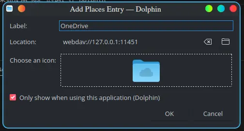
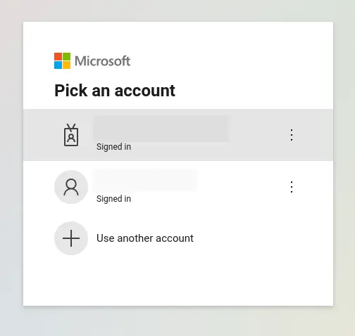

有时候我还是很羡慕 Windows 用户能在他们的资源管理器里面直接和 OneDrive 交互，我想要在 Linux 上也实现这样的功能。恰好我有 OneDrive 帐号，结合 rclone 即可。

# 非教育版帐号

很简单。安装 rclone 之后，运行 `rclone config` ，按照向导一步步创建配置即可。建议给配置取的名字不要有空格和非英文符号。在创建完毕以后，使用 `rclone lsd <config-name>:` 测试即可。
**注意配置名称后面的那个冒号不要漏掉**。

至于集成在系统里面很简单。可以直接挂载成 FUSE 文件系统给各个程序无缝使用：

```shell
$ rclone mount remote:path /local/path
```

但是如果网络不稳定那就会带来很多奇怪问题，所以参考[这篇文章](https://imbearchild.cyou/archives/2021/12/onedrive-and-rclone-on-linux/#comment-44)使用 Webdav 方法挂载：

```shell
$ rclone serve webdav --addr=127.0.0.1:11451 --user=user --pass=114514 --vfs-cache-mode=full <config-name>:
```

让 rclone 作为 WebDav 服务器运行。如果你使用 KDE 的话，在 Dolphin 中添加一个远程即可：



然后你就可以在右侧的 Remote 中找到 OneDrive 了。第一次点开可能需要你输入用户名和密码，这个用户名和密码是 rclone webdav 服务器的，不是你的微软帐号。


如下图，上面的教育版，下面的是个人帐号。



# 教育版

很遗憾，教育版本不能使用这个方法登录。如果你尝试在浏览器验证，那么会得到 `error=invalid_client` 的消息。`rclone` 如果要接管你的教育版 OneDrive，需要得到域管理员的同意。除非你能够说服学校负责人，否则不能连接第三方应用。所以必须使用其他方法。

Office365 有个功能叫 SharePoint，而这个玩意可以作为 WebDav 操作。对微软复杂的产品我不很了解，但这个 WebDav 是可以直接用 rclone 挂载的。

1. 首先，你需要网页版进入你的 OneDrive，网址应该是以 `https://<你的组织名称>-my.sharepoint.com/personal/<你的帐号名称>/....` 这样的模式开头。

2. 在 OneDrive 的根目录创建一个 `Documents` 目录，当然其他名称也可以。

3. 按照这个模式拼接出 SharePoint 地址：

    ```url
    https://<你的组织名称>-my.sharepoint.com/personal/<你的账户名称>/Documents
    ```

    其实也就是直接复制网址，把后面的多余部分清除，再加上 Documents。账户名称里面的下划线不要改动。

4. 创建 rclone 配置，选择类型是 WebDAV，输入第四步创建的 URL，再选择 `Sharepoint Online, authenticated by Microsoft account` 作为 vendor，接着输入**你的账户名和密码**，也就是你用来登录网页版 OneDrive 的账户名(你的学校邮箱)和密码。

最后的结果应该是这样的：

```shell
Configuration complete.
Options:
- type: webdav
- url: https://<你的组织名称>-my.sharepoint.com/personal/<你的账户名称>/Documents
- vendor: sharepoint
- user: 你的账户
- pass: *** ENCRYPTED ***
```

接下来使用 `rclone lsd <config-name>:` 测试即可。挂载集成和之前一样，开一个 rclone 的 WebDav 再转手一次。

## 注意事项

1. 虽然配置的 url 是 Documents，但是实际挂载的就是整个网盘，url 路径和挂载无关，但必须要有一个，不能是根目录。
2. 如果你的 OneDrive 网页版还登录着，那么 Dolphin 中挂载的 SharePoint 就是只读的，必须把其他 session 全部退出再重新挂载才能读写。
3. 如果你碰到了 `Failed to create file system for "xxx:": :  ()` 这样的问题，就是你的账户名和密码不对，检测一遍。**username 就是你的邮箱，不是 「Domain\User」 的格式，也不要把点号替换成 url 里面的下划线**。

# sftp公钥登录

Dolphin 支持的远程协议很多，包括 sftp，如果你有个服务器的话挂载在本地似乎也不错。直接在 Dolphin 新建，输入 `sftp://<username>@<ip>` 创建配置。

但是，如果你的服务器是公钥登录，就会失败， Dolphin 不会让你输入公钥。你需要修改 `~/.ssh/config`，添加条目来做到自动连接。格式如下：

```ini
Host 114.51.41.191
  HostName 114.51.41.191
  IdentityFile ~/path/of/keyfile
  User username
```

然后就能正常连接了。

# 参见：

- [Linux 版 OneDrive 与 Rclone 食用指南 by IMBEARCHILD](https://imbearchild.cyou/archives/2021/12/onedrive-and-rclone-on-linux/#comment-44)
