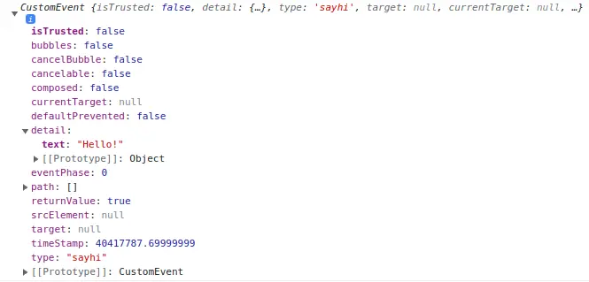

记录一下 Svelte 的概念和基础，省得每次去开教程了。

# 创建项目

注意 `SvelteKit` 和 `Svelte` 不一样。用 `create-vite` 选择就行了。 

# 文件结构

一个 Svelte 组件保存的后缀名是 `.svelte` 内容一般是三个部分，脚本部分，HTML 部分和 CSS 部分。CSS 是只作用于这一个组件的。各个组件可以互相引用，就像 React 那样 Import。举例：

```html
<script lang="ts"> 
	import Another from './Another.svelte';
    import picture from './assets/picture.svg'

    const name:string = "hello!"
</script>

<p>This is a paragraph.</p>
<Another></Another> <!-- 也可以用 <Another/> -->


<style>
	p {
		color: purple;
		font-family: 'Comic Sans MS', cursive;
		font-size: 2em;
	}
</style>
```

- 如果一个标签的属性和值相同，可以简单书写，例如：``。
- 如果变量包含的是 HTML，可以使用 `{@html ...}` 标签转义，例如：`<p>{@html `<strong>Hello</strong>`}</p>`。如果引入了 `marked` 这样的处理器，可以直接 `{@html marked(value)}` 这样渲染。

# 事件处理

给 HTML 元素加上 `on:xxxx` 标签注册事件处理器：

```html
<script>
	let count = 0;

	function incrementCount() {
		count += 1;
	}
</script>

<button on:click={incrementCount}>
	Clicked {count} {count === 1 ? 'time' : 'times'}
</button>
```

也可以使用简略形式：

```html
<button on:click="{e=>count++}">
	Clicked {count} {count === 1 ? 'time' : 'times'}
</button>
```

使用 `$:` 来保持引用，这样一个变量改变了，另外一个也能够随之改变。这是一个 [标记语句](https://developer.mozilla.org/zh-CN/docs/Web/JavaScript/Reference/Statements/label)，就是声明了一个特殊的叫做 `$` 的标记。

```javascript
let count = 0;
$: doubled = count * 2;
```

`Svelte` 的更新取决于是否有 assignments 也就是赋值操作，所以单纯的写 `somethings.some_prop = 'xxx'` 不会触发更新。你还需要 `something = something` 才行。对于数组，可以便捷的采用 `numbers = [...numbers, new_element];` 来更新。

```html
<script>
	let numbers = [1, 2, 3, 4];

	function addNumber() {
		numbers = [...numbers, numbers.length + 1];
	}

	$: sum = numbers.reduce((t, n) => t + n, 0);
</script>

<p>{numbers.join(' + ')} = {sum}</p>

<button on:click={addNumber}>
	Add a number
</button>
```

## `modifiers`

用 `|` 来给处理器加额外设置，就像这样：

```html
<script>
	function handleClick() { alert('no more alerts') }
</script>

<button on:click|once={handleClick}> Click me </button>
```

多个可以叠加，类似 `on:click|once|capture={...}` 。

- `preventDefault` ：就是 `e.preventDefault()` 。
- `stopPropagation`：同样地，相当于调用 `e.stopPropagation()`。
- `once`：这个处理器只使用一次。
- `self`：只有在 `event.target` 是元素自己时调用。
- `trusted`：只有 `event.isTrusted` 是 `True` 才调用。比如 `element.click()` 就不是。

# 消息传递

## dispatch

组件之间的消息传递就是所谓 `dispatch`（这个词中文含义是 *调度，派遣，发送* 的意思），比如说有一个 Outside 组件，里面包含了一个 Inner 组件，Inner 组件想要让外部组件更新一项信息，如果用简单的 React 的话那就是把外部组件的对应处理函数作为 Inner 的一个 prop 传送进去，让它调用。如果使用 `dispatch` 方法的话，就是 Inner 向外部组件发送一个消息，告诉他发生了什么，再由外部组件决定干啥。

为此，Inner 组件需要引入 `createEventDispatcher` 来便捷的创建**标准**的消息。而外部组件需要对于每一种类的消息，定义一个 `on:<消息种类>` 的处理器来接收消息。举例如下：

Inner：

```html
<script>
	import { createEventDispatcher } from 'svelte';
	const dispatch = createEventDispatcher();
	function sayHello() {
		dispatch('sayhi', {	text: 'Hello!'});
	}
</script>

<button on:click={sayHello}>
	Click to say hello
</button>
```

Outside：

```html
<script>
	import Inner from './Inner.svelte';

	function handleMessage(event) {
		alert(event.detail.text);
	}
</script>

<Inner on:sayhi={handleMessage}/>
```

接受到的消息是这样的结构，主要关心的数据就是里面的 `detail` 和 `type`：



## 夹心饼干

有时候会遇到「夹心饼干」一样的组件堆叠，最里面的组件要传递信息给最外面的组件，于是要穿越中间很多层，`Svelte` 给被穿越的那些组件提供了简单的数据传递写法。一个没有处理器的 `on:xxx` 会转发一切到上层：

```html
<Inner on:sayhi/>
```

`on:xxx` 不仅仅可以转发自定义的消息，对于 DOM 事件也可以转发。所以可以对最内层的某个按钮的 click 事件一层层转发到最上层处理。

# 组件的 props

就像 React 的 props 一样，不过是以 `export` 变量的形式定义的：

```html
<script>
	export let answer = 'default value';	// answer 是 props，可以设定默认值
</script>

<p>The answer is {answer}</p>
```

其他组件调用它是这样：

```html
<script>
	import MyElement from './Nested.svelte';
</script>

<MyElement answer={42}/>
```

对于有很多属性的组件，可以用简略的方法定义一个 `Object` 放进去。假如有一个组件有四个 props ：`name`，`version`，`speed`，`website`：

```html
<script>
	import Info from './Info.svelte';

	const pkg = {
		name: 'svelte',
		version: 3,
		speed: 'blazing',
		website: 'https://svelte.dev'
	};
</script>

<!--不要这样做-->
<Info name={pkg.name} version={pkg.version} speed={pkg.speed} website={pkg.website}/> 
<!--用缩略形式-->
<Info {...pkg}/>
```

# 按需渲染

## if

```javascript
// if...
{#if user.loggedIn}
	<button on:click={toggle}> Log out </button>
{/if}

// if...else
{#if user.loggedIn}
	<button on:click={toggle}>
		Log out
	</button>
{:else}
	<button on:click={toggle}>
		Log in
	</button>
{/if}

// if...else if...
{#if x > 10}
	<p>{x} is greater than 10</p>
{:else if 5 > x}
	<p>{x} is less than 5</p>
{:else}
	<p>{x} is between 5 and 10</p>
{/if}
```

## each

循环，类似于 React 中的 `map` 函数：

```js
<ul>
	{#each ['hello','world'] as str,index}
		{index} -> {str} <br/>
	{/each}
</ul>
```

如果循环的对象是一个复杂的 `Object`，那么可以直接解构。假如数据 `addrs` 是 `{name:string, age:number, address:string}` 类型的数组，那么可以这样：

```js
{#each addrs {name, age, address}, index}
	// processing data
{/each}
```

默认情况下，当改变 `each` 中的数据时，最后一个项目会被增加或者删除，然后更新每一个更改的项目。也就是说，**它是倒着更新的**，所以，需要指定一个 `key`。

```svelte
{#each things as thing (thing.name) }
	<Thing name={thing.name}/>
{/each}

{#each things as {id,name},index (id) }	// key 的括号放在最后
	{id} {name} {index} <br/>
{/each}
```

## Promise

直接给 `promise` 包装一层，很方便：

```js
{#await fetch('https://www.bing.com/')}
	<p>...waiting</p>
{:then data}
	<p>{data}</p>
{:catch error}
	<p style="color: red">{error}</p>
{/await}

// 相同
{#await fetch('https://www.bing.com/') then data}
	{data}
{:catch error}
	<p style="color: red">{error}</p>
{/await}
```

# 绑定

通过绑定，可以更好的处理一些交互式元素，特别是 `input` 类的处理：

## input

```html
<script>
	let name = 'world', a = 1, b = 2;
</script>

<input bind:value={name}>
<input type=number bind:value={a} min=0 max=10>
<input type=range bind:value={a} min=0 max=10>

<h1>Hello {name}!</h1>
```

如果不使用 `bind` 的话，就需要捕获输入事件，定义一个处理这个事件的函数，再更新数据，比较繁琐。

对于一般的数据，使用 `bind:value`，对于 checkbox 是否选中，使用 `bind:checked`。如果你需要绑定更多值，则可以使用 `bind:group` 将 value 属性放在一起使用。那么多个组件就共享一个数据源了。**`bind:group` 只能用于 checkbox 和 `radio`**

对于 `each` 中的元素，可以挨个绑定，详见[这里](https://svelte.dev/tutorial/each-block-bindings)。

## select

```html
<script>
let questions = [
	{ id: 1, text: `Where did you go to school?` },
	{ id: 2, text: `What is your mother's name?` },
	{ id: 3, text: `What is another personal fact that an attacker could easily find with Google?` }
], selected;
<script/>
<select bind:value={selected} on:change="{() => answer = ''}">
	{#each questions as question}
		<option value={question}>
			{question.text}
		</option>
	{/each}
</select>
```

`selected` 的内容是 `{id:number, text:string}` 的类型。

## 可编辑元素

```html
<script>
	let html = '<p>Write some text!</p>';
</script>

<div
	contenteditable="true"
	bind:innerHTML={html}
></div>
```

## 尺寸绑定

每个块级标签都可以对 `clientWidth`、`clientHeight`、`offsetWidth` 以及 `offsetHeight` 属性进行绑定：

```html
<div bind:clientWidth={w} bind:clientHeight={h}>
	<span style="font-size: {size}px">{text}</span>
</div>
```

这些绑定是只读的，更改 w 和 h 的值不会有任何效果。

# 生命周期处理

- `onMount` fired after the component is rendered
- `onDestroy` fired after the component is destroyed
- `beforeUpdate` fired before the DOM is updated
- `afterUpdate` fired after the DOM is updated

## `onMount`

在每个组件第一次渲染之后触发。

```html
<script>
	import { onMount } from 'svelte';
	let data=0

	console.log(`Data is ${data}`)	// 0
	onMount(()=>{data=100;})
</script>

<b>{data}</b>
```

在 `onMount` 中可以注册 async 函数，例如在里面 await fetch 什么东西。如果注册函数返回一个函数，这个函数将在组件销毁时触发。

## `onDestroy`

`onDestroy` 允许清理数据或停止我们可能在组件初始化时启动的任何操作，例如计时器或使用 `setInterval` 的计划周期函数。

```html
<script>
  import { onMount } from 'svelte'

  onMount(async () => {
    const interval = setInterval(() => {
      console.log('Something...')
    }, 1000)

    return () => {
      clearInterval(interval)
    }
  })
</script>
```

# 调试

使用 `{@debug ...}` tag。

# 参考

1. [The Svelte Handbook](https://flaviocopes.com/book/read/svelte/)