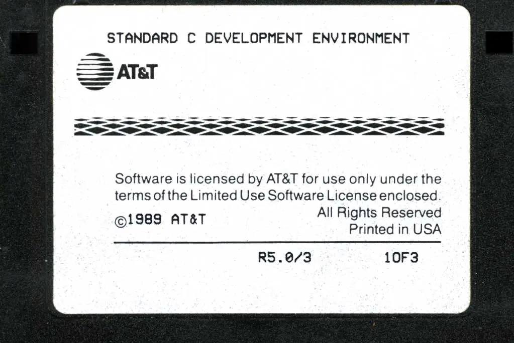

最近考古上瘾，这次打算安装一下 UNIX 的老祖：AT&T System V Unix。

## 主系统

首先是要[下载安装镜像](./assets/AT%26T%20UNIX%20System%20V%20Release%204%20Version%202.1%20(3.5).7z)。这一次下载下来的是若干张 3.5 英寸软盘镜像。安装就从这些软盘镜像开始。创建一个虚拟机，添加 IDE 硬盘以及 I82078 软驱设备，记得不要调过高的 RAM，然后插入启动，软驱中插入 `Base 01 (2.1a).img`，启动：

然后系统就 Panic 了。原因是所谓的 [504MB限制](http://www.steunebrink.info/bioslim.htm#Contents)。

在很久很久以前，至少回溯到 DOS 时代，那时候为了和磁盘交互，系统需要使用 BIOS 中断。也就是调用 `INT 13h` 将跳转到计算机 `BIOS` 代码中进行低级磁盘服务，该代码将为程序执行基于物理扇区的磁盘读取或写入操作。这就使得操作系统不需要处理各个不同硬盘厂商生存的硬盘，只需要和 BIOS 交互即可。早期的 BIOS 可以寻址 1024 个柱面、256 个磁头和 63 个扇区。按照每个扇区 512 bytes 计算，这也就意味着 512 × (1024 × 256 × 63) = 8455716864 bytes 可以达到 8 GB。这也是理论上的最大限制。

很快，为了满足人民群众对更大硬盘的向往，IBM 和 Western Digital 又发明了另外一套接口，也就是 (IDE/AT) HD Interface，理论上相当不错：65535 个柱面、16 个磁头和 256 个扇区，乘起来就是 65535 × 16 × 256 × 512 = 137436856320 bytes 相当于约 127.5 GB。

然而问题在于：**这两套系统并不相互兼容**，孤独的天才们独立创作，丝毫没有和同行们沟通。为了让两个系统可以合作，只能对使用每个规格中最小的进行寻址！也就是说：

16 柱面 x 1024 磁头 x 63 扇区 x 512 bytes 每个扇区 = 528,482,304 Bytes = 504 MB

所以为了安装能够继续下去，最方便的方法就是新建一个新的 VDI，设置大小为 503 MB。

接下来的工作很无聊：按照屏幕上的提示，格式化硬盘，重启，然后挨个把对应的软盘放进去安装。

然后是设置密码，主机名等等。

重启，大功告成。

## 安装软件

这是一个很「干净的系统」，`/usr/bin` 目录下只有 255 个程序，相比之下我的电脑上有 2950 个之多。当然，这玩意也是有包管理器的，只不过并没有网络功能，需要依靠软盘安装。键入 `pkgadd -d diskette1`
再按照提示将包含软件包的磁碟放入即可安装。

安装完毕后重启，**如果卡在第一屏一动不动，只有光标闪烁，说明忘记把软件安装软盘弹出软驱。**。

但是这些软件包中并没有 C 编译器套件。你可以在[这里](http://www.bitsavers.org/bits/ATT/SYSV_386/SYSV_Rel_4.0_Ver_1.0_386_486_partial.zip)下载它们。其中包括的 `Standard_C_Development_Environment_R5.0` 就是 C 开发环境。

接下来需要做的是把 IMD 镜像转换成 IMG 格式。有一个工具 [disk-utilities](https://github.com/keirf/Disk-Utilities) 可以做到这一点。克隆仓库并编译之。然后使用 `disk-analyse input.IMD output.img` 即可。如果遇到 `error while loading shared libraries: libdisk.so.0`，更新 LD_PATH 为 `LD_LIBRARY_PATH=libdisk disk-analyse/disk-analyse` 即可。方便起见，将转换完毕的文件放在[这里](./assets/Standard_C_Development_Environment_R5.0.7z)。插入安装：

安装完毕后，使用 vi 编辑器创建源文件并编译成功。

