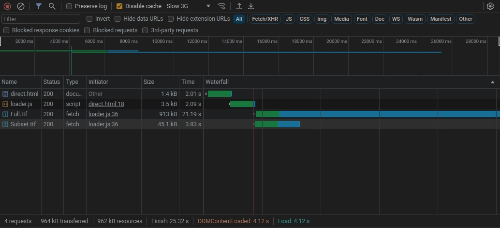
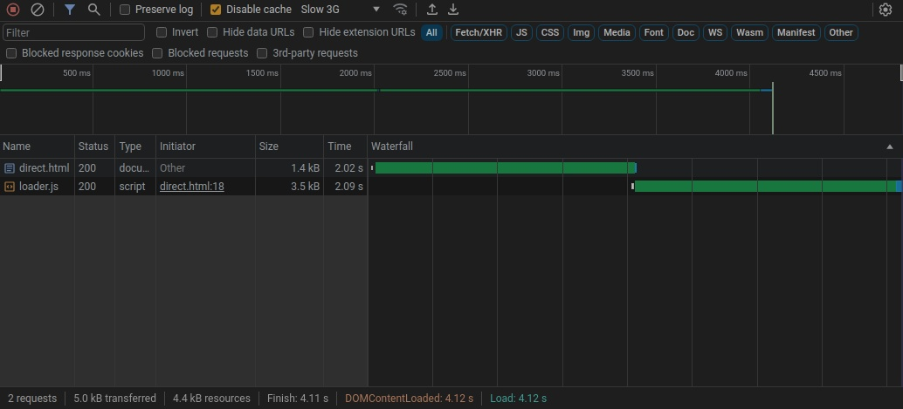

最近又想要重构一下这个破站，因此又一次要面对字体加载问题。现在使用的解决方案是，对于每一篇文章单独生成一个压缩过后的子集字体文件，不过这种方法只适用于确定内容的页面，不能在动态页面使用，而且由于网络环境的原因，虽然每个子集文件大小一般不超过 1M，还是比较慢，且由于是托管式的静态站点，也没法直接改 `Cache-Control`。所以显而易见需要手动干预一下缓存流程，达到加载一次，以后就无须重复加载的目的。

当然我并不是不知道有这么一个 `service workers`，不过一开始我只是以为这玩意只和 PWA 应用有关，没有深入了解，于是采用了更加复杂的方式。

想要搞缓存，那自然是要把下载的字体保存在本地，那首先需要解决「如何在 JS 中加载字体」的问题。使用 CSS 的 `@font-face` 是典型的操作，但是这种请求似乎不能通过 JS 干预，所幸 JS 也有自己的动态加载机制 [`FontFace`](https://developer.mozilla.org/en-US/docs/Web/API/FontFace) 可以使用，这么一来，只需要在 CSS 中指定 `font-family`，然后在 JS 中 `fetch` 后加载就行了：

```js
function addFontToPage(arrayBuffer, name) {
    const font = new FontFace(name, arrayBuffer);
    document.fonts.add(font);
    font.load();
}

fetch(target.location)
  .then(resp => resp.arrayBuffer())
  .then(arrayBuffer => {
      console.log('font downloaded successfully!');
      addFontToPage(arrayBuffer, target.name);
  })
```

对应的 CSS 还是按照原来的书写，不过无须引入 `@font-face`:

```css
p {
    font-family: 'Subset', 'Full', sans-serif;
}
```

那么接下来要解决的问题就是如何把这些字体保存在本地。`localStorage` 很自然的出现在脑中，然而很遗憾，在尝试之后我发现它无法满足要求：首先，`localStorage` 只适合字符串的存储，这点在它的签名上就能看出来：`setItem(key: string, value: string): void;`，而下载的字体文件是二进制文件，没法直接保存。当然，似乎可以用各种奇技淫巧来在 `String` 和 `ArrayBuffer` 之间转来换去，但还有一个「其次」在等着你：`localStorage` 的存储大小是由限制的，[大概是 10MB 左右](https://developer.mozilla.org/en-US/docs/Web/API/Web_Storage_API#web_storage_concepts_and_usage)，一旦超出就会出错。（你可以自己[测试一下](https://arty.name/localstorage.html)）。同样的，直接使用 base64 data url 也会遇到大小限制的问题，而且 F12 以后 Inspector 里面显示的大串数据真的是惨不忍睹。所以，想要存储较大的二进制数据，需要用到其他技术，我选择了 `IndexedDB`。

*IndexedDB 是一种在用户浏览器内持久化存储数据的方法。它可以让你创建具有丰富查询能力的 Web 应用，而无需考虑网络可用性，因此你的应用在在线和离线时都可以正常运行。*总之听起来很不错，由于是异步的，而且多少算是个 `DB`，所以操作起来还是有些麻烦：

```js
// 打开数据库
const dbRequest = indexedDB.open("DB", 1);

// 创建一个 scheme
dbRequest.onupgradeneeded = function () {
    const db = dbRequest.result;
    /*
    创建一个 ObjectStore，就像是数据库中的一张「表」，但是里面可以存放任何 JS Object
    而它的「主键」就是 keyPath，这个 createObjectStore 只能在 onupgradeneeded 回调中使用。
    */
    db.createObjectStore("objStore", { keyPath: "id" });
};

dbRequest.onsuccess = function () {
    // 数据库打开成功
    let db = dbRequest.result;
    let tx = db.transaction("objStore", "readwrite");
    let store = tx.objectStore("objStore");

    // 增改
    store.put({ id: 114514, data: 'anything' });

    // 查
    let query = store.get(12345);
    query.onsuccess = function () {
        console.log(query.result.data);
    };

    // 删
    store.delete(114514);

    // 关闭
    tx.oncomplete = () => {
        db.close();
    };
}
```

有了这一套以后就可以开工了：首先正常的写 CSS，但不使用 @font-face 引入，而是使用一个 loader 函数，先查询本地数据库缓存中是否有这个字体，如果有则返回，否则再 `fetch` 保存。一旦出错，则重新在插入 `style` 元素补齐 @font-face：

```js
function fallback(name, location) {
    const elem = document.createElement("style");
    elem.innerHTML = `@font-face {
        font-family: ${name};
        src: url(${location});
        font-display: swap;
    }`;
    document.head.appendChild(elem);
}

function loadFontFull(targets) {
    const IDBRequest = window.indexedDB.open("FONTDB", 1);

    IDBRequest.onerror = e => {
        console.error("Unable to open database.");
        targets.forEach(e => { fallback(e.name, e.location) });
    }
    IDBRequest.onupgradeneeded = function () {
        let db = IDBRequest.result,
            store = db.createObjectStore("Fonts", { keyPath: "id" });
    };

    IDBRequest.onsuccess = function () {
        for (const target of targets) {
            const FONT_CACHE_KEY = `font.${target.name}.downloaded`;

            if (localStorage.getItem(FONT_CACHE_KEY) === null) {
                fetch(target.location)
                    .then(resp => resp.arrayBuffer())
                    .then(arrayBuffer => {
                        let db = IDBRequest.result,
                            tx = db.transaction("Fonts", "readwrite");
                        let store = tx.objectStore("Fonts");
                        let operation = store.put({
                            id: target.name,
                            data: arrayBuffer
                        });
                        operation.onsuccess = e => {
                            localStorage.setItem(FONT_CACHE_KEY, true);
                            addFontToPage(arrayBuffer, target.name);
                        };
                        operation.onerror = e => {
                            targets.forEach(e => { fallback(e.name, e.location) });
                        }
                    })
                    .catch(e => {
                        targets.forEach(e => { fallback(e.name, e.location) });
                    })
            } else {
                let store = IDBRequest.result.transaction("Fonts", "readwrite").objectStore("Fonts");
                const fontReq = store.get(target.name);
                fontReq.onsuccess = e => {
                    console.log('font loaded from IndexDB successfully!');
                    addFontToPage(fontReq.result.data, target.name);
                };
                fontReq.onerror = e => {
                    targets.forEach(e => { fallback(e.name, e.location) });
                }
            }
        }
    };
}

document.addEventListener("DOMContentLoaded", () => {
    try { loadFontFull(FONTS); } catch (e) {
        FONTS.forEach(e => { fallback(e.name, e.location) });
    }
});
```

使用 Chrome， 开启 Slow 3G 模拟测试，最后的结果如下：





当然别忘了转 woff 字体。以上测试见[此处](./assets/direct.html)。
