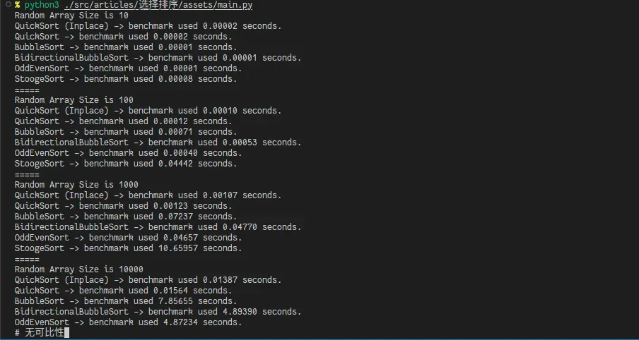

在交换类排序算法中，已知最好的选择算法是快速排序。

# 冒泡排序

很简单的排序算法，效率很低，但是简单易懂。初中就学过。具体的来讲，就是一遍一遍的扫描数组，碰见顺序不对的把他俩调换一下位置。最后还需要额外扫描一遍确保排序好了。这是一个*原地*的排序算法。

```python
def bubble_sort(array: list[int]) -> None:
    swapped: bool = True
    while swapped:
        swapped = False
        for index in range(len(array) - 1):
            if array[index] > array[index + 1]:
                array[index], array[index + 1] = array[index + 1], array[index]
                swapped = True
```

# 双向冒泡排序

和冒泡排序类似，但是每次扫描过后不是从头再来，而是从反方向扫描，减少总的扫描次数。同样是*原地*排序。

```python
def bbs(array: list[int]) -> None:
    swapped: bool = True
    while swapped:
        swapped = False
        for index in range(len(array) - 1):
            if array[index] > array[index + 1]:
                array[index + 1], array[index] = array[index], array[index + 1]
                swapped = True
        for index in range(len(array) - 2, 0, -1):
            if array[index] < array[index - 1]:
                array[index - 1], array[index] = array[index], array[index - 1]
                swapped = True
```

# 奇偶排序

和冒泡排序类似，但是步长为 2 。先是比较数组中相邻的（奇-偶）位置数字对，下一次再（偶-奇）比较位置数字对，如果该奇偶对是错误的顺序（第一个大于第二个），则交换。同样是*原地*算法。

```python
def odd_even_sort(array: list[int]) -> None:
    sorted: bool = False
    while not sorted:
        sorted = True
        for i in range(1, len(array) - 1, 2):
            if array[i] > array[i + 1]:
                array[i], array[i + 1] = array[i + 1], array[i]
                sorted = False
        for i in range(0, len(array) - 1, 2):
            if array[i] > array[i + 1]:
                array[i], array[i + 1] = array[i + 1], array[i]
                sorted = False
```
 
# 皮匠排序

<del>很奇怪的名字</del>，来源是算法导论 7.3 练习题。不过第三版已经改成 `Alternative quicksort analysis` 了（

- 如果最后一个值小于第一个值，则交换
- 如果当前集合元素数量大于等于3：

    - 使用皮匠法排序前2/3的元素
    - 使用皮匠法排序后2/3的元素
    - 再次使用皮匠法排序前2/3的元素

**很慢很慢。**

```python
  def stooge_sort(array: list[int], start=0, end=None) -> None:
      if end == None:
          end = len(array) - 1
      if array[start] > array[end]:
          array[start], array[end] = array[end], array[start]
      if end - start + 1 > 2:
          divide = floor((end - start + 1) / 3)
          StoogeSort.stooge_sort(array, start, end - divide)
          StoogeSort.stooge_sort(array, start + divide, end)
          StoogeSort.stooge_sort(array, start, end - divide)
```

# 快速排序

快速排序就是，选择一个基准元素，通常是中间那个，把大于它的放在一边，小于它的放在另外一边，再对两边的分别继续这样操作。最后就能得到排序好的序列了。

最容易理解的「标准版本」如下：

```python
def quicksort(array: list[int]) -> list[int]:
    # 如果只有一个元素，直接返回
    if len(array) <= 1:
        return array

    left: list[int] = list()
    right: list[int] = list()
    # mid 是 pivot 元素的索引
    mid: int = (len(array) - 1) // 2

    for index, element in enumerate(array):
        # 对于每一个元素，大于 pivot 的放在右边，否则放在左边
        if index == mid:
            continue
        right.append(element) if element > array[mid] else left.append(element)

    # 不要忘记中间的 pivot 元素
    # 它必须单独列出来，不能放在左边或者右边
    return quicksort(left) + [array[mid]] + quicksort(right)
```

使用 `quicksort(original_array)` 来对数组排序。

除此以外还有一个原地排序的版本。常见于 `C` 等的实现。

```python
def partition(array: list[int], low: int, high: int) -> int:
    pivotElement = array[(low + high) // 2]
    left, right = low - 1, high + 1

    while True:
        left, right = left + 1, right - 1
        while array[left] < pivotElement:
            left += 1
        while array[right] > pivotElement:
            right -= 1
        if left >= right:
            return right
        array[left], array[right] = array[right], array[left]
```

使用 `quicksort(numbers, 0, len(numbers) - 1)` 来进行排序。

参考：

- [维基百科 Quicksort](https://en.wikipedia.org/wiki/Quicksort)
- [快排(quick sort) C++ 实现](https://jdhao.github.io/2021/07/10/quick_sort_impl/)

另附：`Javascript` 写的简短版本（[来源](https://tsejx.github.io/data-structure-and-algorithms-guidebook/algorithms/sorting/quick-sort)）：

```javascript
const quickSort = (arr) => {
    return arr.length <= 1
        ? arr
        : quickSort(arr.slice(1).filter(item => item <= arr[0])).concat(
            arr[0],
            quickSort(arr.slice(1).filter(item => item > arr[0]))
        );
};
```

# 测试

对上述排序算法进行测试，使用一个装饰器进行计时。

```python
from random import randint
import time

def timeit(function):
    def func(*args, **kwargs):
        time_start = time.perf_counter()
        result = function(*args, **kwargs)
        print(f"{function.__name__} used {time.perf_counter()-time_start:.5f} seconds.")
        return result

    return func

RANDOM_ARRAY = [randint(-32768, 32768) for i in range(10000)]
ANSWER = sorted(RANDOM_ARRAY)

if __name__ == "__main__":
    # 各个测试代码
```

结果如下：



可以在[这里](assets/main.py)下载测试代码。

除此以外，[这个站点](https://cglab.ca/~morin/misc/sortalg/)描述了很多经典排序算法，均为 `Java` 实现：