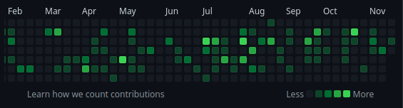

# 起因

我希望能够给自己的日记项目升级一下，参考Github的贡献热力图，构造一个类似的组件。查看了一圈，要么是比较老的库，要么不提供我熟悉的`ReactJS+Typescript`框架，再
加上我的需求其实很简单，于是决定自己实现一个简单的热力图。

# 需求



首先它需要和Github的热力图看上去类似，我就不做的那么细致，直接20个星期，每个星期7天，一共140天。不标注月份，但在左侧标注星期几。

为了好看，要求本日固定在右下角的最后一个格子，星期显示自然要跟着同步。除此以外，鼠标划过需要在右下角显示这一天的日期。
其他的组件，图例，颜色，黑夜模式什么的可以日后再调教。

# 思路

## 界面构成

我看了一眼Github的前端，发现小格子都是按列排的`<svg>`元素和`<rect>`元素。肯定这样是性能更加高，不过这么一来还需要
学svg，<del>总之，我有一万种偷懒的理由</del>，最终决定使用`<div>`+CSS画格子。

这样的构图很容易就想得出来创建一个矩阵，每个格子对应座标，而每一列作为一个组件，用flex排一下。

## 数据格式

最方便的就是JSON传个矩阵过来，但这样太肥了。所以打算按照间接寻址来算。以右下角最后一个格子(19,6)为0地址，把整个
热力图矩阵看作是一个线性数组，一直向前推即可。比如8就是对应(18,6)。而每一个方格只有固定的几种可能性，按照绿色的
程度分为1，2，3，4四个级别，0为没有颜色。因为大多数方格是没有颜色的，所以只需要把1，2，3，4四个级别包含的格子指明
即可推出整个矩阵。

整个Component的props格式定义如下:

``` typescript
interface HeatMap_Data_T {
    "1"?: Array<number>,
    "2"?: Array<number>,
    "3"?: Array<number>,
    "4"?: Array<number>
}
```

而组件内部的status就很简单了，直接根据props推出来整个矩阵即可。每个矩阵元素保存该方格的level。

```typescript
type HeatMap_Data_Internal_T = {
        matrix: Array<Array<number>>[20][7],
        infoString: string
    };
```

## 组件

分三个层次，整个组件`HeatMap`,列`HeatMapColum`,和单元格`HeatMapElement`。

### HeatMapElement

很简单，需要的props为座标，level和一个状态提升函数。座标用来传递给状态提升函数，level进行字符串拼接转为传为className
给CSS。整个组件写成function component.

``` jsx
function HeatMapElement(props: {
    level: number,
    addr: [number, number],
    bubbleFunc: (addr: [number, number]) => any
}) {
    return (
        <div
            key={'_hc' + Math.random()}
            className={`heatMap_element level_${props.level}`}
            onMouseEnter={(e) => { props.bubbleFunc(props.addr) }}
        ></div>
    )
}
```

### HeatMapColum

用来包含小方格的组件，props为x座标，相应矩阵的数据切片（代表这个星期），以及一个状态提升函数。

``` jsx
class HeatMapColum extends React.Component<{
    weekSlice: Array<number>,
    addr_x: number,
    bubbleFunc: (addr: [number, number]) => any
}, {}>{
    constructor(props: any) {
        super(props);
    }

    render(): ReactNode {
        return (
            <div className="heatMap_colum">
                {
                    [...new Array(7).keys()].map(i => {
                        return <HeatMapElement
                            bubbleFunc={addr => { this.props.bubbleFunc(addr) }}
                            key={'_hc_' + i}
                            level={this.props.weekSlice[i]}
                            addr={[this.props.addr_x, i]}
                        ></HeatMapElement>
                    })
                }
            </div>
        )
    }
}
```

*如果想要避免for循环，直接在`render()`里面开数组，就用`[...new Array(number).keys()]`就地创建。*

### HeatMap

最主要的组件。比较长，不全放上来。

``` jsx
export class HeatMap extends Component<{ data: HeatMap_Data_T }, HeatMap_Data_Internal_T>{
    constructor(props: any) {
        super(props);
        const internal = Array.from(new Array(20), () => new Array(7).fill(0))
        Object.keys(this.props.data).map(i => {
            for (const index of this.props.data[i]) {
                const [_x, _y, level] = [20 - Math.floor(index / 7) - 1, 7 - index % 7 - 1, i];
                internal[_x][_y] = level;
            }
        })

        this.state = { matrix: internal as any, infoString: '' }
    }

    static readonly weekDays: Array<{ name: string; day: number; }> = [
        // 一个星期的每一天, 略
        { name: '日', day: 7 },
    ]

    private handleMouseHover(addr: [number, number]) {
        // 更新infoString, 略
    }

    render(): ReactNode {
        const today = new Date().getDay();
        const weekdayDisplay = HeatMap.weekDays.map(i => {
            i.day < today ? i.day += 999 : (i.day == today ? i.day -= 999 : null)
            return i;
        })
            .sort((a, b) => b.day - a.day)
            .map(i => <div key={'_hw' + i.day} className="heatMap_weekday">{i.name}</div>)

        return (
            <div id="HeatMap">
                <div className="heatMap_main">
                    <div> {weekdayDisplay} </div>
                    {[...new Array(20).keys()].map(i => {
                            return <HeatMapColum
                                bubbleFunc={addr => { this.handleMouseHover(addr) }}
                                addr_x={i}
                                weekSlice={this.state.matrix[i]}
                                key={'_hr' + i}></HeatMapColum>
                    })}
                </div>
                <p className="heatMap_detail">{this.state.infoString}</p>
            </div>
        )
    }
}
```

主要值得注意的是`weekdayDisplay`的处理和使用`Array.from(new Array(20), () => new Array(7).fill(0))`来创建矩阵。

## 其他杂项

### CSS

很少啊很少

```css
.heatMap_main {
    display: flex;
}

.heatMap_element {
    width: 12px;
    height: 12px;
    border: 1px solid #dedddf;
    margin: 1px;
    border-radius: 2px;
}

.heatMap_element:hover {
    border: 1px solid black
}

.heatMap_weekday {
    width: 36px;
    text-align: center;
    line-height: 8.5px;
    margin-top: 6px
}

.heatMap_detail {
    float: right;
    padding-right: 14px;
}

#HeatMap {
    padding: 10px;
    width: 370px;
}
```

# 实现

使用实验数据:

```js
    {
      "1": [0, 1, 2],
      "3": [8, 17],
      "2": [4, 6],
      "4": [115, 139]
    }
```

最终结果是这样的：


# TODO

- 用svg来替换div
- 适应手机端