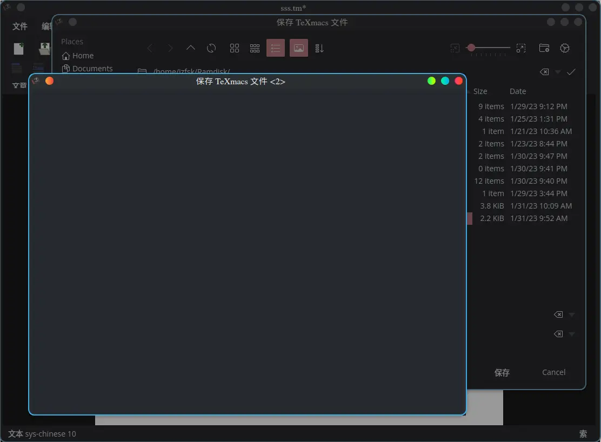
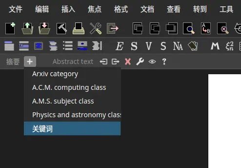
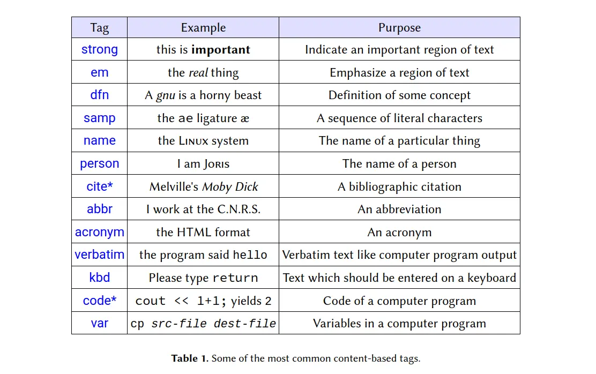
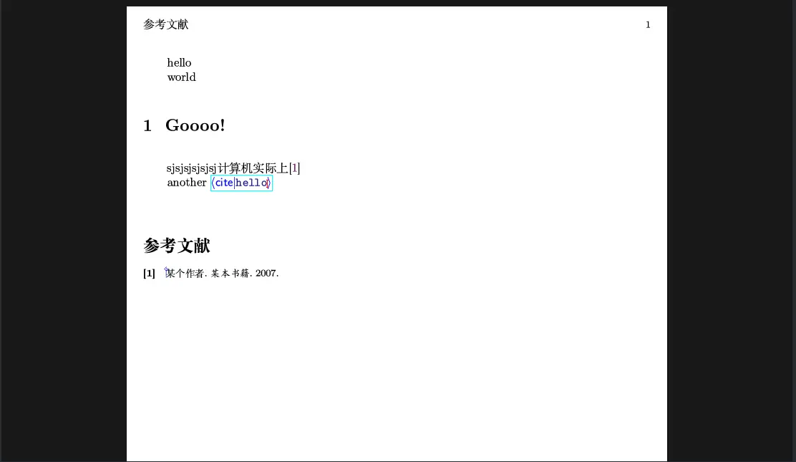
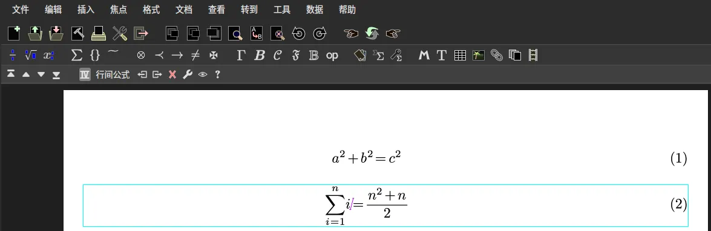

<style>

.latex sub {
  vertical-align: -0.1ex;
  margin-left: -0.1667em;
  margin-right: -0.025em;
}

.latex sub, .latex sup {
  font-size: 0.9em;
  text-transform:uppercase;

}
.latex sup {
  font-size: 0.85em;
  vertical-align: -0.2em;
  margin-left: -0.26em;
  margin-right: -0.05em;
}

</style>

我被 LibreOffice 折磨了五年。

为了替换它，我尝试了 Markdown，但它的功能太简单了，尝试了 <span class="latex">L<sup>A</sup>T<sub>E</sub>X</span>，但是首先我没学会，其次我从来没有成功的让它显示中文字符，并且它的大小也太夸张了。最后我找到了 [GNU TeXmacs](https://www.texmacs.org/tmweb/home/welcome.en.html)。我以前也不是没有听说过，但是受到它的名字的误导，我认为它是一个「使用 Emacs 的 TeX 编辑器」。其实它和两者的关系不大。

`openSUSE` 的软件源里面没有，需要[下载 rpm 包](https://texmacs.org/tmweb/download/linux-packages.en.html#suse)安装。

在使用 TeXmacs 之前免不了需要解决一些疑难杂症。都和中文有关。首先是文档语言无法选择中文的问题，你需要在首选项中将界面语言改为中文才行，同样的，如果需要选择日文就把界面语言改为日文，其他各种不能用键盘上的字母表达的语言操作类似。其次是输入中文乱码的问题，在有些系统上，默认的中文字体 `sys-chinese` 是没有的，所以会指定到 `TeX` 的默认字体，自然无法显示中文。你需要给 TeXmacs 添加字体才行。所幸官网给出了中文字体包：[fireflysung](ftp://ftp.texmacs.org/pub/TeXmacs/fonts/TeXmacs-chinese-fonts.tar.gz)。你需要把它解压到 `~/.TeXmacs/fonts` 里面。最后目录结构应该是这样的:

``` erlang
fonts
├── enc
├── error
├── font-characteristics.scm
├── font-database.scm
├── font-features.scm
├── pk
├── tfm
├── truetype
│   ├── FandolBraille-Display.otf
│   ├── FandolBraille-Regular.otf
│   ├── FandolFang-Regular.otf
│   ├── FandolHei-Bold.otf
│   ├── FandolHei-Regular.otf
│   ├── FandolKai-Regular.otf
│   ├── FandolSong-Bold.otf
│   ├── FandolSong-Regular.otf
│   └── fireflysung.ttf
├── type1
├── unpacked
└── virtual
```

不要忘记添加以后运行 `texmacs --delete-font-cache` 清除缓存，然后就可以使用了。另外建议把宋体楷体什么的也安排上，直接用 [`CTAN`](https://www.ctan.org/tex-archive/fonts/fandol/) 的包就行。

除此以外，在保存时也会遇到问题，焦点会强制集中在一个什么都没有的窗口上，不过不影响后面文件选择窗口的操作，记得**输入文件名**。它保存的是纯文本文件，内容格式类似于 `XML`。



下面记录一些常见的操作。

## 内置的模板

使用 `文档 -> 样式` 来选取预定的样式，直接选择 `article` 即可。它包含了标题，作者，摘要之类的东西。可以自己改进，但是它的模板似乎是用类似 scheme 的 dsl 写的...

## 文章结构

标准的文章结构是标题，摘要，正文等等。**关键词是放在摘要里面的**，所以在摘要环境的菜单里面选中。



## 文本格式

和 `Word` 之类的软件类似，菜单上的选项是不言而喻的。不过如果不想离开键盘，还可以使用 `tex` 命令。 `tex` 命令都以 `\` 开头，输入以后可以自动补全。诸如 `strong` ，`code`，`abbr` 之类的文本格式可以直接输入。步骤是输入 `\` 再在蓝色尖括号中输入指令，按下回车就行。输入完毕以后移动到块以外。常见的格式如下：



然后是给文章添加节，同样是使用 `TEX` 命令。用 `\section` 添加节，`\subsection` 添加子节，还有 `\subsubsection` 之类。添加以后会自动更新，所以不用担心序号错乱问题。

## 添加目录

在想要添加目录的地方，使用 `\table-of-contents` 命令，接下来按回车，再在 `|` 后面输入 `toc` 即可。命令看上去是这样的：`<\table-of-contents|toc>`。接下来回车就行。但是目录不会自己更新。需要在 `文档 -> 更新 -> 目录` 中手动更新一下。

## 参考文献的添加

首先需要一个 `BibTeX` 文件。它算是一个引用数据库，在主文档里面引用它里面的内容即可。比如说有一个 `BibTeX` 文件是这样：

```bibtex
@misc{hello,
        author = "Nobody Jr",
        title = "My Article",
        year = "2006" 
}
@book{pci,  
        title = "某本书籍",  
        author = "某个作者",  
        year = "2007",  
}
```

然后在 `插入自动生生成的内容 -> 参考文献` 中选择这个文件。注意：**bibtex 文件必须在同一个目录！**。接下来在需要引用的地方使用 `<\cite|name>` ，然后刷新**两次**即可。

注意事项：

1. Bibtex 文件的后缀名必须是 `.bib`
2. 引用标签不能是中文，否则乱码



不管是添加表格也好，添加其他内容也罢，当焦点在对应的元素环境里面时，第三列工具栏就会显示为当前环境的相关工具。比如表格就会显示添加行列的按钮等。

我的应用场景是对排版元素要求不高的电子版作业，考虑到我的专业，基本没有公式和复杂表格的需求，所以用起来还是绰绰有余的。但是毕竟公式编辑是它最激动人心的功能,所以还是看一眼。

## 公式编辑

直接键入 `shift + 4` 进入数学模式，然后就可以编辑了。



好吧，总的来说我应该是用不上的。

## 参考

- [TeXmacs 文档(英文)](https://texmacs.org/tmweb/documents/manuals/texmacs-manual.en.pdf)
- [学术文章写作利器: TeXmacs介绍](https://x-wei.github.io/TeXmacs_intro.html)
- [TeXmacs Plugs](https://github.com/texmacs/plugins)