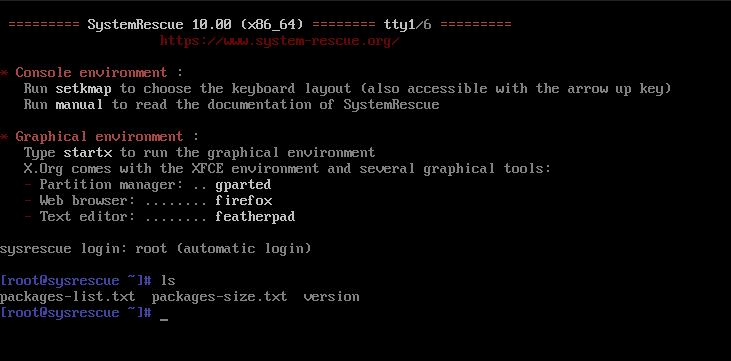
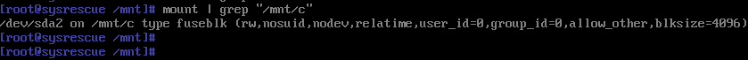
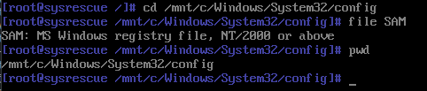
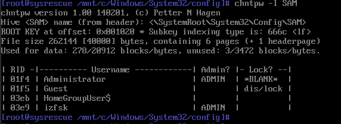
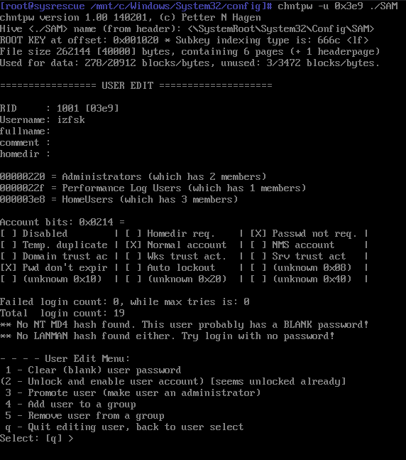

对于上了密码的 Windows 系统，虽然没办法直接登录，但只要没有全盘加密，并且 BIOS 没有上锁，就可以通过引导其他系统来清除密码。

## 准备

`chntpw` 这个工具大多数常规 Linux 发行版并不会在 Live 系统里面预置。据说 Kail 的 Live CD 里面有自带这个工具，但我从来没用过 Kail。我选择的是专门用来进行系统维护的 `SystemRescueCd`。可以在[这里](https://www.system-rescue.org/Download/)下载其 iso 文件。刻录完成后即可使用。

实际测试表明，`chntpw` 可以更改 Windows 10 家庭普通版的密码。

## 进入系统

首先需要进 BIOS 修改启动顺序，顺便把安全启动关掉。然后进入系统：



## 挂载硬盘

需要找到的是装有 Windows 根目录(?)的那个硬盘分区，一般的电脑就是最大的那一个。当然，实在拿不准的话就把几个硬盘都挂载上再说。


对于 Windows 7 和 Windows 8.1，大多数情况下就直接挂载成功了，最多自动做一个 fixing 也就继续挂载。但是对于 Windows 10 和 Windows 11，默认情况下系统会保留休眠文件（hiberfile.sys）以供下次快速启动。当然，可以在 Windows 里面用 powercfg 关掉，但咱们这么搞不就是因为不知道密码么（

解决方案，使用 `ntfs-3g` 移除休眠文件即可，但首先需要把自动只读挂载的分区 umount 掉。

接下来：

```sh
ntfs-3g -o remove_hiberfile /dev/sdXN /path/to/mount
```

确保是读写挂载：



## 找到并更改 SAM 文件

Windows 的用户数据库位于 `c/Windows/System32/config`:



接下来使用 `chntpw -l SAM` 列出所有用户的资料：



接下来选取用户进入交互编辑模式。使用 RID 而用用户名，因为用户名可能包含空格甚至非 ASCII 字符，tty 下根本打不出来。在键入 RID 注意格式，例如 `01f4` 要键入为 `0x1f4`：



要清除密码，键入 `1` 然后回车即可。操作完毕以后，输入 `q` 回车，会提示是否保存，键入 `y` 回车确认就完成了。

接下来回到根目录 `sync && mount /mnt/c` 即可。再次进入 Windows ，密码就消失了。

## 建议和提示

1. `chntpw` 不能从哈希还原出密码，除非是你自己的电脑，直接清除用户密码就是告诉机主自己过来溜门撬锁过。因此要记得备份原来的 SAM 文件以供还原。

2. 关于 `Administrator` 账户：现代 Windows 中 Administrator 账户并不是没有，只是默认被禁用了，这一点 `chntpw -l` 可以看得到。除了选择清除已有用户的密码，还可以选择激活这个默认没有密码的账户。在使用 Administrator 进入 Windows 并操作完成后，可以 `net user administrator /active:no` 再禁用它。

3. 无论如何，你总会留下蛛丝马迹，比如审核日志，比如消失的休眠文件，害人之心不可有。

## 参考

- [Unable to mount Windows (NTFS) filesystem due to hibernation](https://askubuntu.com/questions/145902/unable-to-mount-windows-ntfs-filesystem-due-to-hibernation)
- [启用和禁用内置管理员帐户](https://learn.microsoft.com/zh-cn/windows-hardware/manufacture/desktop/enable-and-disable-the-built-in-administrator-account)
- [Man page of chntpw](https://manpages.debian.org/bookworm/chntpw/chntpw.8.en.html)
