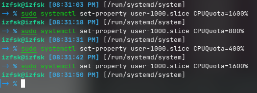
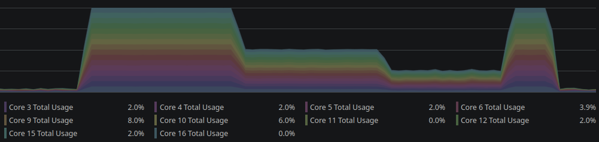
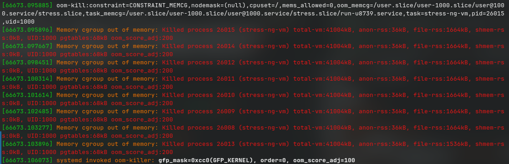
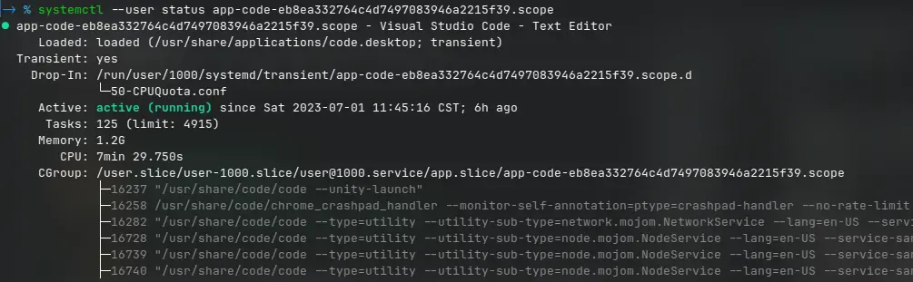

`systemd` 是大多数 Linux 发行版的事实规范，不管大家喜不喜欢都要用它。这篇文章希望解决的问题是“精确的管理和控制进程/应用的各项资源”。

## 并不只是“进程”

对于 `systemd` 来讲这样的细分不够，还需要有某种把若干相关的进程组织起来的抽象。`systemd` 里面主要有三种单元（`Unit`）类型：

- `.service`：服务是 `systemd` 依据磁盘上的配置文件自己启动的东西。一般使用 `systemctl start/stop` 操纵的就是这类“服务”。

- `.scope`：不由配置文件启动的一组进程。只能以编程方式声明和启动。比如说使用 `fork` 调用出来的子进程。比如说，在 `konsole` 里面运行 `htop`，那么这个进程就会出现在某个 `scope` 里面。

- `.slice`：`slice` 和 `cgroup` 密切相关，每一个 `cgroup` 都是一个 `slice`，每个 `slice` 都可以有自己的子 `slice`。一个 `slice` 里面包含若干进程和/或子 `slice`。

`systemd` 自己有预先定义若干 `slice`，分别是 `system.slice`，`user.slice`，`machine.slice`。所有的系统服务都放在 `system.slice` 之中，每一个登录的用户会被分配到自己所属的 `user.slice` 下的一个子 `slice` 之中，`machine.slice` 则是给虚拟化服务使用的。

使用 `systemd-cgls` 可以查看机器上的 `cgroup` 树，举例来讲：

```r{.r .numberLines}
Control group /:
-.slice
├─user.slice (#888)
│ └─user-1000.slice (#2819)
│   ├─user@1000.service … (#2899)
│   │ → user.delegate: 1
│   │ ├─session.slice (#3129)
│   │ │ └─dbus.service (#3169)
│   │ │   ├─1636 /usr/bin/dbus-daemon --session --address=systemd: --nofork --n…
│   │ │   └─3169 /usr/libexec/kf5/kiod5
│   │ ├─background.slice (#3204)
│   │ │ └─kde-baloo.service (#3314)
│   │ │   └─1720 /usr/libexec/baloo_file
│   │ ├─app.slice (#2979)
│   │ │ ├─app-firefox-b09f12b43b3d4b4dbf4098d695489166.scope (#5075)
│   │ │ │ ├─ 2340 /usr/lib64/firefox/firefox -contentproc -childID 264 -isForBr…
│   │ │ │ ├─ 4026 /usr/lib64/firefox/firefox
│   │ │ │ ├─ 4112 /usr/lib64/firefox/firefox -contentproc -parentBuildID 202306…
│   │ │ │ ├─ 4143 /usr/lib64/firefox/firefox -contentproc -childID 1 -isForBrow…
│   │ │ │ ├─ 4175 /usr/lib64/firefox/firefox -contentproc -childID 2 -isForBrow…
│   │ │ │ ├─ 4264 /usr/bin/plasma-browser-integration-host /usr/lib64/mozilla/n…
│   │ │ │ ├─19214 /usr/lib64/firefox/firefox -contentproc -childID 330 -isForBr…
│   │ │ │ └─30710 /usr/libexec/kf5/kio_http_cache_cleaner
│   │ └─init.scope (#2939)
│   │   ├─1608 /usr/lib/systemd/systemd --user
│   │   └─1609 (sd-pam)
│   └─session-3.scope (#3089)
│     → user.invocation_id: 73cac7153fd44d02b76ea50f1a559f7c
│     └─9421 scdaemon --multi-server
├─init.scope (#19)
│ └─1 /usr/lib/systemd/systemd --switched-root --system --deserialize=39
└─system.slice (#54)
  ├─cron.service (#2210)
  │ → user.invocation_id: d3c7344407014f80b4201d10bb4be93a
  │ └─1563 /usr/sbin/cron -n
  ├─display-manager.service (#2142)
  │ → user.invocation_id: 35ed91d9971249c4a6c654e1cdf383f4
  │ ├─1410 /usr/bin/sddm
  │ └─1412 /usr/bin/Xorg.bin -nolisten tcp -auth /run/sddm/{05446e81-5704-45ac-…
  └─systemd-logind.service (#1989)
    → user.invocation_id: 3dc53b6e8c274294b617383903571d5f
    └─1294 /usr/lib/systemd/systemd-logind
```

（以上的内容有删减。）

你可以看到，对于系统服务，例如 `cron`，是运行在 `system.slice` 里面的，而对于用户进程，比如火狐浏览器(app-firefox-b09f12b43b3d4b4dbf4098d695489166.scope)，则是被放置在 `user/user-1000/app.slice` 中。其中包含所有火狐的内容进程和其他进程。其他的进程类似。实际上很多应用并不是包含一个进程，像火狐，或者 Chrome 之类的应用都可以在 `app.slice` 里面找到对应的 `scope`。

其实 `systemd` 有一个桌面环境规范，定义了常在桌面环境中见到的 `slice`，来应用程序分配不同的优先级。所有单元都应根据其用途被放入：

- `session.slice`： 只包含运行用户图形会话所需的进程。
- `app.slice`： 包含用户正在运行的所有普通应用程序
- `background.slice`： 适用于低优先级的后台任务

所以，像 KDE 的文件索引程序 `baloo` 就会被放在 `background.slice` 里面。

## 能控制些啥

### CPU

对于 CPU 的控制，主要使用 `CPUQuota`，`CPUWeight`。

`CPUQuota` 控制的是单元在最大时应获得多少 CPU 时间，也就是严格的 CPU 资源的使用上限，接收一个百分比值，例如 `CPUQuota=85%`，对于多核 CPU，这个百分比可以超过 100%，有多少个核心就可以达到多少，比如对于 16 核心的 CPU，最大可以是 `CPUQuota=1600%` 。

`CPUWeight` 替换了原来的 `CPUShare`，用来设置相对使用时间（相对权重），其值是一个整数，允许的范围是 1 到 10000 。

实例：

```sh
# 增加 CPU 负载
stress-ng -c 16
```

动态改变 `user.slice`：





### 内存

对于内存的使用控制，主要采用 `MemoryHigh` 和 `MemoryMax`。

两者都接收整数值作为大小（bytes），也可以输入（K，G，M，T）的单位和百分比，用于表示最多占用机器多少比例内存。其中，`MemoryHigh` 是主要的控制机制，是对目标最大可用内存的“软限制”，目标**可能**短暂的超过内存限制但其超出部分会被旋即回收。而 `MemoryMax` 是绝对硬限制，进程超出就会出发 `OOM` 被当即处决。实践中结合两者使用，软硬兼施。

实例：

```sh
# 生成进程
systemd-run --slice=stress.slice  --user stress-ng --vm 8 --vm-bytes 256M
# Running as unit: run-u8748.service

# 更改内存控制
systemctl --user set-property 'stress.slice'  MemoryMax=10000
```

结果是 `stress-ng` 被 OOM 杀死：



对于启用的 SWAP 的系统，还有一个 `MemorySwapMax` 可以进行控制。这是一个绝对限制。

### 网络

使用 `IPAddressAllow` 和 `IPAddressDeny` 来控制目标的联网。

- 当被检查的IP地址与 IPAddressAllow 列表中的条目相匹配时，访问被授予。IPAddressAllow 列表中的条目时，允许访问。
- 否则，当检查的IP地址与 IPAddressDeny 列表中的条目相匹配时，将拒绝访问。IPAddressDeny 列表中的条目时，访问被拒绝。
- 否则，允许访问。

| 名称         | 定义     | 含义 |
|--------------|-----------|------------|
| any |  `0.0.0.0/0 ::/0`      |  所有网络地址      |
| localhost  | `0.0.0.0/0 ::/0`  | 本地回环    |

例如，要禁止联网：`systemctl set-property user.slice IPAddressDeny=any`。

除了上面提到的，cgroup 还可以控制 IO，块设备访问等等，参见：[systemd.resource-control](https://manpages.ubuntu.com/manpages/impish/man5/systemd.resource-control.5.html)

## 怎么控制



### 通过 `systemd-run`

创建一个临时控制组群：

`systemd-run --unit=<name> --slice=<name>.slice <command>`

其中： `--unit=<name>` 选项为单元取一个名称。如果未指定 `--unit`，则会自动生成名称。`--slice=<name>.slice` 选项使单元成为指定片段的成员。默认情况下，服务和范围作为 systemslice 的成员创建。

成功后将会提示： `Running as unit <name>.service`

适用情况：想要一次性运行一个临时的任务，直接给出限制。例如：

```sh
# 在 Linux 上玩 Minecraft，限制 Java 最多可以获取的内存大小 8192MB
systemd-run --scope --user -p MemoryMax=8192M -p MemoryHigh=8192M java -jar minecraft.jar

# 不紧不慢的更新数据库
systemd-run -p IOWeight=10 updatedb
```

适用情况：运行一个临时的任务，但想要把它放在某个特定的组里便于统一管理：

```sh
# 将一个任务放在已有的 slice 里面
systemd-run --user --slice=app.slice --scope htop 

# 将任务放进一个新的 slice 里面（默认位于 user-uid.slice 之下）
systemd-run --user --slice=noNetwork.slice --scope some-application
```

### 通过 `cgroupfs`

位于 `/sys/fs/cgroup/` 的伪文件系统可用于手动查看和配置 cgroup。要查看某个进程所属的 cgroup，请运行 `cat proc/<PID>/cgroup` 命令。

适用情况：想要手动调整某个 slice：

```sh
# 比如要调节火狐，首先过滤出它到底是在哪一个 slice 里面：
ps -aux | grep firefox 
systemctl status pid
# CGroup: /user.slice/user-1000.slice/user@1000.service
# 接下来到指定的目录：
cd /sys/fs/cgroup/user.slice/user-1000.slice/user@1000.service/app.slice/app-firefox-b09f12b43b3d4b4dbf4098d695489166.scope
# 查看这个组里面包含的进程 PID
cat cgroup.procs
# 接下来就可以进行调节了
```

### 通过 `systemctl set-property`

这是最方便的方法。

还是以调节火狐为例，首先从 `systemd-cgls` 里面找出其组名称：

```sh
systemctl --user set-property 'app-firefox-b09f12b43b3d4b4dbf4098d695489166.scope' CPUQuota=100%  
```

对于使用 `systemd-run` 创建的任务单元（返回 `Running as unit <name>.service` 的），以及`systemd-cgls` 列出的大部分内容，无论是 slice，service 还是 scope 都可以这样管理，很方便。**注意：必须添加 `--user` 选项，否则找不到对应的单元!**

### 用户单元配置文件

对于想要持久化的配置，可以使用 systemd 单元配置文件。其路径一般位于 `~/.config/systemd/user`，示例如下：

新建文件 `limitMemory.slice`

```ini
[Slice]
MemoryHigh=8192M
MemoryMax=8092M
```

然后运行 `systemctl --user daemon-reload` 接下来对于想要限制内存的应用程序这样运行：

```sh
systemd-run --user --slice=limitMemory.slice chromium
```

或者写 service 也可以：

```ini
[Unit]
Description=Minecraft Game

[Service]
WorkingDirectory=/run/media/izfsk/Data/Games
Environment="__NV_PRIME_RENDER_OFFLOAD=1"
Environment="__GLX_VENDOR_LIBRARY_NAME=nvidia"

ExecStart=java -jar /run/media/izfsk/Data/Games/minecraft.jar
ExecStop=killall java

MemoryMax=9000M
```

接下来

```sh
systemctl --user daemon-reload
systemctl --user start minecraft
# 查看日志
journalctl --user -u minecraft --follow --output cat
```

## 其他提示

1. `slice` 的命名规则：把 - 符号当作路径分隔符。例如 `foo-bar-baz.slice` 应该理解成 `foo/bar/baz.slice`。systemd 会把特殊字符 escape （ `systemd-escape` ）来避免出现 - 符号。

2. 不要在 `systemd` 管理的任意 `cgroup` 下面创建自己的 `cgroup`，即没有设置 `Delegate=`的 `cgroup`。不要在根 `cgroup` 下面创建自己的 `cgroup`。“如果你直接在 `cgroup` 根目录下创建 `cgroup`，那么你所做的一切都是自找麻烦。”（Seriously, if you create cgroups directly in the cgroup root, then all you do is ask for trouble.）。

3. 不要对 `systemd` 创建的 `cgroup` 的任何属性进行写入。

## 参考

- [Control Group v2](https://docs.kernel.org/admin-guide/cgroup-v2.html)
- [Systemd-run](https://www.freedesktop.org/software/systemd/man/systemd-run.html)
- [systemd.resource-control](https://manpages.ubuntu.com/manpages/impish/man5/systemd.resource-control.5.html)
- [CGROUP_DELEGATION](https://systemd.io/CGROUP_DELEGATION/)
- [使用 systemd 管理应用程序使用的资源](https://access.redhat.com/documentation/zh-cn/red_hat_enterprise_linux/9/html/managing_monitoring_and_updating_the_kernel/assembly_using-systemd-to-manage-resources-used-by-applications_managing-monitoring-and-updating-the-kernel)
