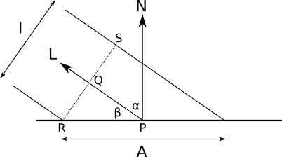
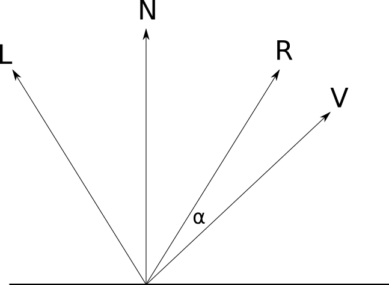

# 关于颜色

人类的眼睛只能看见特定波长的光（`visible range`），低于的部分叫做红外线，高出的叫做紫外线。所有的颜色都可以看成是几种原色（`primary colors`）的线性组合。

## 减色模型（`Subtractive Color Model`）

物体反射光线，白色的光线照射到某个物体上，该物体在反射的同时吸收了一部分波长的光（这些颜色被“减去”）了。例如，白纸上的黄色图案只允许黄色通过，蓝色图案只允许蓝色通过，不断叠加，最后不允许任何颜色通过，那就是黑色。实际操作中的减色模型一般使用 `CMYK` 模型，四中基本色是 Cyan, Magenta, Yellow 和 Black。

## 增色模型（`Additive Color Model`）

有的物体不发光，有的物体发光。对于发光的物体，使用增色模型，例如电脑屏幕，放大以后就能看见小小的三种颜色的发光元件密集排列。在这种情况下，几种原色的混合不是形成黑色，而是形成白色。

## 颜色的相关计算

设一个颜色表示为：

$$
(R,G,B)
$$

那么

$$
k\cdot(R,G,B) = (kR,kG,kB)
$$
$$
(R_1,G_1,B_1)+(R_2,G_2,B_2)=(R_1+R_2,G_1+G_2,B_1+B_2)
$$

# 关于光源

## 点状光源（`Point Lights`或`Omnidirectional Lights`）

点状光源位于$3D$空间中一点，向各个方向放射出光线，类似于白炽灯。对于空间中的任何一点，点状光源对其的光照向量都是不同的。

## 有向光源（`Directional Lights`）

有向光源没有位置，具有固定的方向，在地球上太阳就相当于一个有向光源。对于环境中的每一点，有向光源对其的光照向量的都是一样的。

## 环境光源（`Ambient Light`）

如果没有环境光源，那么没有被光源直接照射到的地方将会是完全的黑色，这并不河里，物体本身或多或少都会反射光，这些复杂的反射光构成了环境光源。它只有强度。对于一个场景来讲，只有一个环境光源，可以有任意个点状或有向光源。

# 关于反射

## 法向（`normal`）

黑话，全称是“法向量”。垂直于面上一点$P$之单位向量谓之法向量，用于该面方向 之表征。想象一下`Blender`里面拖动面的那个垂直箭头。

## 漫反射（`Diffuse Reflection`）

漫反射的物体将光线均等的反射到所有方向，无论在什么方向看这个物体都是一样的。可以看成一个凹凸不平的平面，坑坑洼洼，所以光线被反射到各个不同的方向。例如纸张或者一般墙壁。漫反射所反射的光线的数量取决于光照的角度。角度越大，同样能量的光照就要分布到更大面积的物体上，那么这个物体受到的光照能量就越小。

给漫反射建模，就是要找出给定光照的前提下，这个表面上的点到底反射出了啥。

- 光线$L$具有强度$I$，方向$\vec L$
- 平面的法向量$N$

假设光线的“宽度”($I$)就是它的强度，那么$A$的长度就是平面得到的能量。可以看出随着$\beta$越来越大，$A$越来越趋近于$I$，那么表面也就越亮，反之，$\lim_{A \to \infty} {I \over A} = 0$，那么也就是一片黑暗了。

毫无疑问，表面光照与法线和光照夹角有关，表示为一个函数：

$$
{I \over A} 
=
{{\vec{N} \cdot \vec{L}} \over {|\vec{N}||\vec{L}|}}
$$

### 漫反射公式

The Diffuse Reflection Equation：

$$
I_P = 
I_A 
+ 
\sum_{i = 1}^{n} I_i 
    {{\vec{N} \cdot \vec{L_i}} 
    \over 
    {|\vec{N}||\vec{L_i}|}}
$$

其中：

- $I_P:$具有法向$\vec N$的点$P$所获得的全部光照
- $I_A:$环境光照的强度
- ${{\vec{N} \cdot \vec{L}} \over {|\vec{N}||\vec{L}|}}:{I \over A}$
- $I_i \cdot {{\vec{N} \cdot \vec{L}} \over {|\vec{N}||\vec{L}|}}:$计算光照强度

## 镜面反射（`Specular Reflection`）

与漫反射不同，镜面反射就是让光线怎么进来怎么出去。很好理解。

$N$是法向，光线从$L$进去，从$R$出来，我们位于$V$的摄影机看到的光线就是要计算的目标。当$\alpha=0$，你就被亮瞎啦。

### 镜面反射公式

$$
\vec{R} = 2\vec{N} \langle \vec{N}, \vec{L} \rangle - \vec{L}
$$
$$
I_S = I_L \left( {{\langle \vec{R}, \vec{V} \rangle} \over {|\vec{R}||\vec{V}|}} \right)^s
$$

那么

$$
I_P = I_A + \sum_{i = 1}^{n} I_i \cdot \left[ {{{\langle \vec{N}, \vec{L_i} \rangle} \over {|\vec{N}||\vec{L_i}|}} + \left( {{\langle \vec{R_i}, \vec{V} \rangle} \over {|\vec{R_i}||\vec{V}|}} \right)^s} \right]
$$

参考：

- [computer-graphics-from-scratch - Light](https://www.gabrielgambetta.com/computer-graphics-from-scratch/03-light.html)