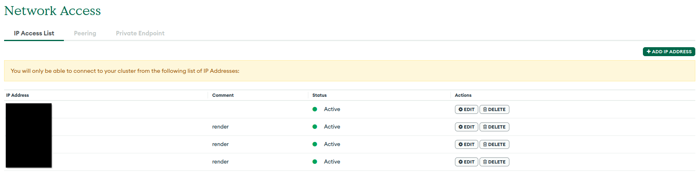

我要为站点添加一个计数器小组件，按惯例，虽然有现成的免费服务，比如[这个](https://moe-counter.glitch.me/)或者[这个](https://hits.seeyoufarm.com)，但我还是决定自己造一个。最终我利用一系列可以白嫖的服务构建了一个简单的访问计数器。

## 原理

计数器的原理很简单，就是「有访问，则加一」。一个可行的实现就是用 redis 并定期写入到数据库。不过这样一来就需要找到两个（免费的）服务。所以我不使用 redis，直接
操作数据库。经过调查，我发现 MongoDB 有提供免费的 512MB 实例，并且不会有定期清除数据之类恶心人的限制，所以就使用它了。当然，直接在浏览器访问操作数据库是不可能的，
所以我还使用 Render.com 提供的 Web Server 作为中间层，提供一个 api 来给浏览器端调用。其他的诸如 CROS，速率限制就不多赘述了。

## 源码

源码很少很少，这毕竟不是什么大型服务，而且从网站的访问量来看，基本上不用考虑什么性能问题：

```js
const express = require('express');
const cors = require('cors');
const rateLimit = require('express-rate-limit');
const app = express();
const port = 3000;
const { MongoClient, ServerApiVersion } = require('mongodb');

const uri = "mongodb+srv://me:xxxxxx";

const client = new MongoClient(uri, {
    serverApi: {
        version: ServerApiVersion.v1,
        strict: true,
        deprecationErrors: true,
    }
});

const limiter = rateLimit({
    windowMs: 1 * 60 * 1000, // 1 minute
    max: 60, // Limit each IP to 60 requests per `window` (here, per 15 minutes)
    standardHeaders: true, // Return rate limit info in the `RateLimit-*` headers
    legacyHeaders: false, // Disable the `X-RateLimit-*` headers
})

app.use(limiter);
app.use(cors({
    origin: '*',
}));


async function getAllArticleUUIDs() {
    const request = await fetch("https://raw.githubusercontent.com/izfsk-ium/izfsk-ium.github.io/main/articles/uuids.json");
    return await request.json();
}

app.get('/readOnly/:uuid', (req, res) => {
    async function run() {
        const targetID = req.params.uuid;

        try {
            await client.connect();

            const result = await client.db("count").collection("count").findOne({ "url": targetID });
            if (result === null) {
                res.send("0");
            } else {
                res.send(result.count.toString());
            }
        } finally {
            await client.close();
        }
    }
    run().catch(console.dir);
})

app.get('/counter/:uuid', (req, res) => {
    async function run() {
        const targetID = req.params.uuid;

        try {
            await client.connect();
            const articles = await getAllArticleUUIDs();
            if (articles.indexOf(targetID) == -1) {
                res.send("-1");
                throw Error("No such article : " + targetID.toString());
            }
            const result = await client.db("count").collection("count").findOne({ "url": targetID });
            if (result === null) {
                // create it
                await client.db("count").collection("count").insertOne({ "url": targetID, "count": 1 });
                res.send("0");
            } else {
                // increase it
                await client.db("count").collection("count").updateOne(
                    { "_id": result._id }, // Filter
                    { $set: { "count": result.count + 1 } }, // Update
                    { upsert: true }
                );
                res.send(result.count.toString());
            }
        } finally {
            await client.close();
        }
    }
    run().catch(console.dir);
})

app.listen(port, () => {
    console.log(`Counter app start in -> ${port}`)
})

```

## 部署

### 创建 MongoDB 数据库

这没什么好说的，注册，新建等等有向导，无须过多阐述。要注意的是等会儿为数据库添加允许访问的 IP。在面板左侧 Security -> Network Access 里面，添加
 Render 的 Static Outbound IP Addresses。




### 创建 Render 项目

先在 GitHub 创建一个私有仓库，给 Render 使用。**由于在这里 mongodb 的连接字符串是写死在代码里的，所以一定要设置为私有**。

新建一个 Web Server，把对应的仓库导入进去，填写相应的信息即可。如果愿意的话，在 Cloudflare 里面添加一个子域名绑定也是不错的选择。
Render 为免费用户提供的 Web Server 服务主要的限制是：

- 免费实例类型上的 Web 服务将在 15 分钟不活动后自动停止运行。当收到新的免费服务请求时，Render 会再次启动它，以便可以处理该请求。这意味着有时候请求会花费很长时间，乃至会超时。
- 免费实例类型允许您帐户中的所有免费 Web 服务每月有 750 小时（相当于 31.25 天）的运行时间，并且每个免费服务有 100 GB 的出口带宽。

对于第一个问题，可以使用多种多样的方法「保活」，比如在 VPS 上写一个 cron 任务自动 curl，又比如再设置一个 WebServer，每隔一段时间相互访问，当然这样做似乎不是很厚道的样子XD。

### 添加前端代码

你可能注意到每篇文章最下面的计数器了（如果没有那说明服务器寄了或者重启超时），实现如下：

```js
if (location.href.includes("127.0.0.1:8080")) {
    document.getElementById("counter-span").innerHTML = "[[development mode]]";
} else {
    const uuid = document.getElementById("article-uuid").innerText;
    const target = document.getElementById("counter-span");
    const last = localStorage.getItem("lastVisit-" + uuid);
    const shouldIncrease = last === null || new Date().getTime() - parseInt(last) >= (1000 * 60 * 15);


    fetch(shouldIncrease ? ("https://counter.izfsk.top/counter/" + uuid) : ("https://counter.izfsk.top/readOnly/" + uuid))
    .then(r => r.text())
    .then(d => {
        if (!d.startsWith("Too"))
        document.getElementById("counter-span").innerText = "访问次数：" + d.toString();
        else
        document.getElementById("counter-span").innerHTML = "";
    });


    localStorage.setItem("lastVisit-" + uuid, new Date().getTime());
}
```
