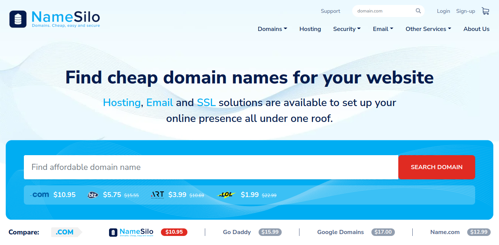
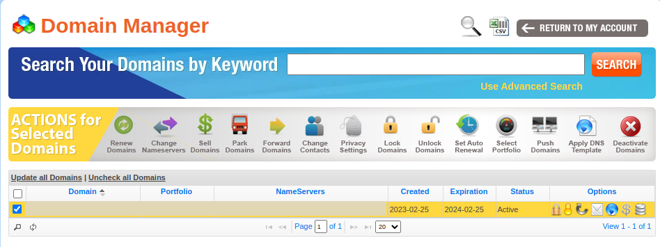
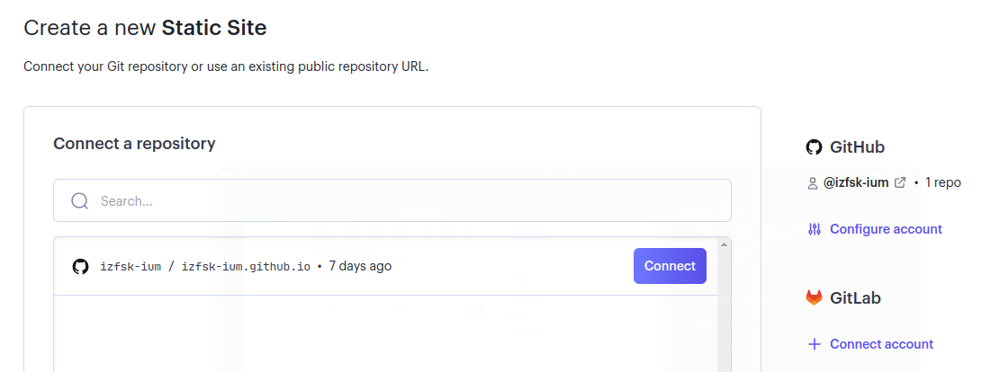
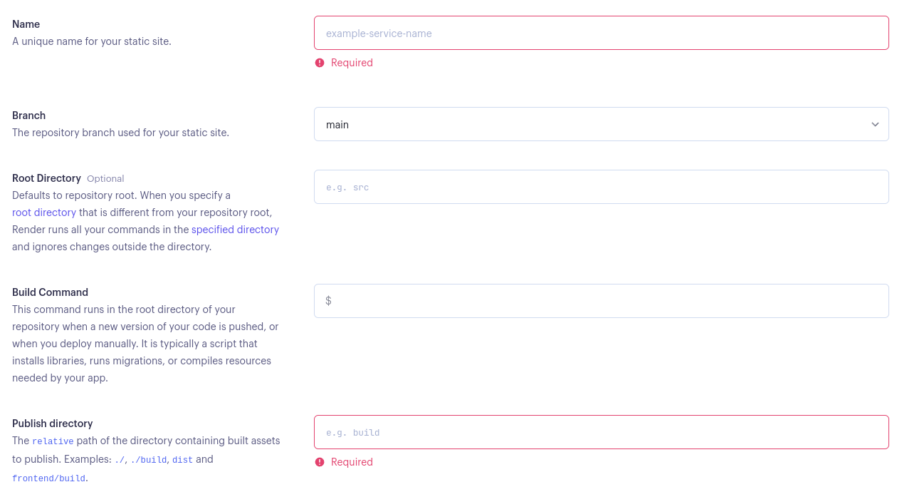
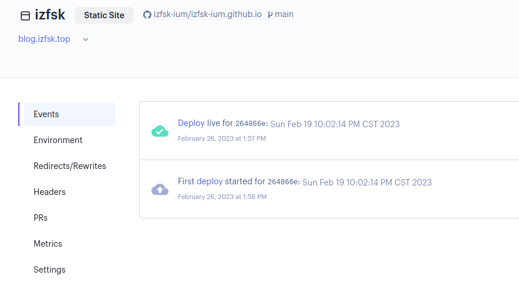
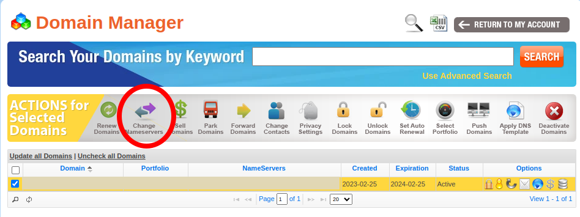
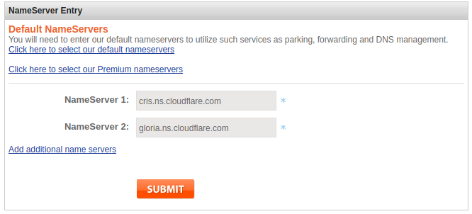
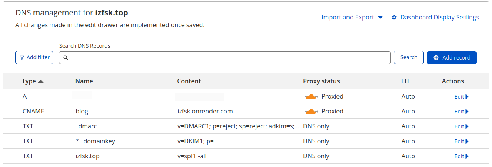
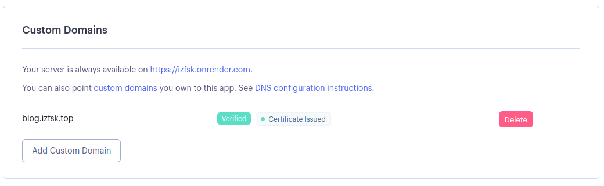

本站进行了一次迁徙，其实也不能说是完全的「迁徙」，但不管怎么样，现在可以使用自己的域名，而不是托管使用 github.io 的子域名了。除此以外，部署方式也作了修改，不再使用中国境内访问慢吞吞的 Github Pages 而采用 render.com 提供的部署服务，同时也套上了 Cloudflare。总之，除了域名费用以外并没有花其他的钱。这篇文章记录一下整个的流程。

# 域名的选择和购买

**购买域名的第一注意事项：不要使用中国的域名注册商家或者购买由中国的公司/组织管理的顶级域名**。这样做纯粹是为了避免麻烦，主要是不可预期的政策风险和及其复杂的备案流程。即使你像我一样只是一个遵纪守法的好公民，这一整套流程下来，钱和精力都要耗费不少。具体的来讲，首先不要购买 `.cn` 的域名，其次不要选择中文域名，最后，在其他域名之间选择时，记得先去 [ICANN Wiki](https://icannwiki.org/) 查询一下你要购买的顶级域名的管理者到底是何方神圣，省得后悔。比如，本站的新域名的顶级域名 [`.top`](https://icannwiki.org/Top_Registry) 就是一家江苏省的公司管理的，这也是我购买以后才发现，真是后悔不迭。

其次，要注意「第一年价格」和「续费价格」，有的域名第一年很便宜，但之后续费就飙升到几十乃至上百美元，另外还需要注意各种附加服务，提防不小心选择到自己不需要的东西。

我选择的域名注册商家是 [Namesilo](http://namesilo.com)，主要原因是它支持支付宝支付。选择和购买很简单顺畅，毕竟没有一个商家会在用户付款的路上添堵。然而，相比于它现代的选择购买界面：

它的后台管理界面似乎让你回到了 15 年前：

以至于我第一次进入时以为自己被什么野鸡商家骗了钱（

接下来在右边第二个「Domain Manager」里面确认你的域名即可。

# Render

Github Pages 其实已经很好了，但是由于众所周知的原因，中国境内访问它时不时会被阻断和劣化。所以需要另外一个部署服务来「加速」。有不少教程推荐使用 Netlify，但是它很荣幸的在我所在的区域被 reset 了。所以我选择其他替代方案。

其实这些服务，Netlify 也好，Render 也好，对于我这样的用户来讲都是大同小异的。我用不到复杂的功能，只是作为一个静态站点同步和部署来用。

直接在[这里](https://dashboard.render.com/register)注册登录，如果使用 Github 登录，可以直接快捷的绑定 repo。选择创建一个新的 Static Site，然后点击右侧的 「Configure account
」绑定 Github 帐号里面的相应 repo 点击 Connect 即可。

然后就是配置。你需要起一个名字，它同样是一个二级域名：`*.onrender.com`。不过既然接下来要自定义域名这个也无关紧要。我的站点是完全本地生成后 push 到仓库的，所以没有 Build Command，Publish directory 则是根目录 `./`。**默认情况下每一次对源 repo 的 push 都会触发一次更新**，不需要手动设置。

接下来是等待部署。等到部署完成后，就可以访问了。同时，状态变成这样：

此时可以访问 `name.onrender.com` 访问了。这种情况下它相当于是一个类似 Github Pages 但是略微加速。

# Cloudflare

使用它不仅仅是出于防止 DDOS 或者的考虑，<del>毕竟 CDN 能减速。</del>其实这反而是次要的考虑。要使用 Cloudflare ，首先需要把域名的 nameserver 转移到 Cloudflare 那边去。Cloudflare 注册以后会有一个向导，一步一步来就行了。主要是 namesilo 那边。你需要先勾选复选框，再点击：

然后把原来的删除，添加 Cloudflare 给你的：

接下来是 CF 这边，DNS 缓存的全球更新需要一点时间，所以需要等一会儿。接下来就是设置解析地址，点到你的域名，DNS 设置里面添加。DNS 记录可以理解成一个 K-V 对，主要需要知道的三种记录类型：

- A : 域名 -> IPv4 地址
- AAAA : 域名 -> IPv6 地址
- CNAME : 域名 -> 另外一个域名

添加好相应的域名即可。注意在导入站点的时候，会发现有几条不认识的 A 记录，那是 Namesilo 的广告页面，删掉就行。添加 `A` 记录可以使用中国境内的 VPS 地址也可以正常访问，但是**有合规性风险**，不建议尝试。「要么全是(中国)境外，要么全是(中国)境内」，不要混着来。

所以，访问 `blog.izfsk.top` 就会相应的跳转到 `izfsk.onrender.com` 那边去。但是，此时还是不能够正常使用，因为 Render 那边的 `Custom Domains` 还没有设置。回到 Render 的 Dashboard 里面找到你的项目，在 Settings 里面，添加自定义的域名即可。需要等待一会儿 DNS 刷新以及 Render 处理证书。最后的状态是这样的：

那么就大功告成啦！

其实 Render 还支持免费(有大小和时间限制的) PostgreSQL 服务和 Web Service 服务，完全可以折腾一下搞一个评论功能，把白嫖进行到底（
