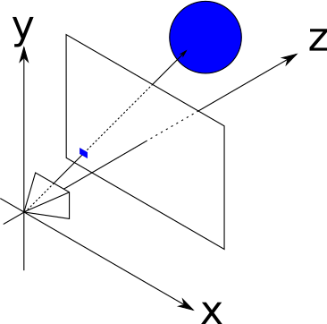
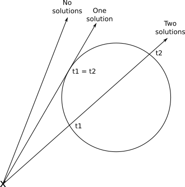

# 光线追踪

如图所示



摄像机位于坐标系原点，设为$O$，方框则为 Viewport．设$V_w=V_h=d=1$单位长度时，视角$FOV=53^o$.要从$O$进行光线追踪，就是从原点发出一条射线(实际的光线是从物体反射到摄影机，而不是从摄影机发射出去)，穿过 Viewport 直达物体. 光线追踪的算法如下：

```
❶Place the camera and the viewport as desired
For each pixel on the canvas
❷Determine which square on the viewport corresponds to this pixel
❸Determine the color seen through that square
❹Paint the pixel with that color
```

1. 放置摄像机(camera)和(viewport)
2. 对于画布(canvas)上的每一个点:
    - 找出 Viewport 上对应的那一个点
    - 找出对应的颜色
    - 在画布上画出那个点

# 光路表示

给定原点$O$，$\vec {VO}$ 为光线的方向，设为$\vec D$，那么该光线上的任意一点$P$可以这样表示：$P=O+t\vec D$

# 球的表示

为了简单起见，设空间中的物体为球，即：与一固定点$C$距离为$r$的所有点$P$的集合，即向量$\vec {PC}$的长度为$r$.

$$
|\vec {PC}|=r
$$

又

$$
\vec {PC} \cdot \vec {PC} = r^2 
$$

所以得到方程组，也就是光线和球的交点：

$$
\begin{cases}
\vec {PC} \cdot \vec {PC} = r^2 \\
P = O+t \vec D
\end{cases}
$$

其中：

- $O$为原点
- $r$为半径
- $C$为圆心
- $\vec D=\vec {VO}$即光线的方向

所以要求的就是$t$.

# 方程组

把二式代入一式：

$$
\langle O + t\vec{D} - C, O + t\vec{D} - C \rangle = r^2 = 
$$
$$
(\vec{CO}+t\cdot\vec{D})\cdot \vec{CO}+(\vec{CO}+t\cdot\vec{D})\cdot t\cdot \vec{D} = 
$$
$$
\vec{CO}^2+2\cdot\cdot t \cdot \vec{D}+t \cdot \vec{D}^2 = r^2
$$

也就是二次方程：

$$
t^2 \cdot \vec{D}^2 + 2 \cdot t \cdot (\vec{CO} \cdot \vec{D}) + \vec{CO}^2 - r^2 = 0
$$

按照$\Delta$分类讨论：

$$
\Delta = [2(\vec{CO} \cdot \vec{D})]^2 - 4t^2(\vec{CO}^2-r^2)
$$



参考：

- [Basic Raytracing](https://www.gabrielgambetta.com/computer-graphics-from-scratch/02-basic-raytracing.html)