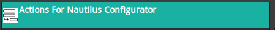
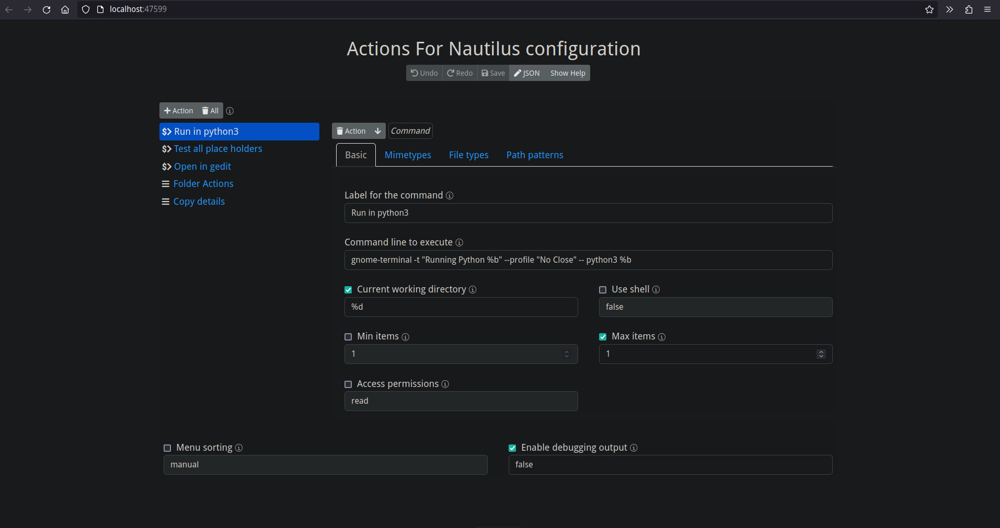

> “GNOME’s […] excuse for not doing something is not it’s too complicated to do , but it would confuse users . The whole we know best thing is a disease.” — Linus Torvalds

首先，我必须要狠狠的吐槽 Nautilus 的设计 —— 事实上是整个 Gnome 的设计哲学，如果这样扭曲的思维也能叫做一种“哲学”的话。默认的Gnome，说得好听叫简洁，说得难听叫简陋，做减法做过头。我知道 Gnome 的设计借鉴和吸收了 MacOS 的简洁，但在实际上，他们似乎搞错了“简洁”和“简陋”的区别。以至于搞出了一个看上去很简洁，但用起来大量缺失基础功能的精品毛坯房。在 Gnome 中，回字不会有四种写法——它干脆不提供这个字。已经是 2023 年了，连 Windows 的资源管理器都添加了“在这里打开终端”的上下文菜单，Nautilus 的菜单项目倒是越来越少了。

当然，Nautilus 天才的设计者对极致简洁的不懈追求并没有止步于不添加新的功能，他们也没有忘记砍掉原本好用的老功能。曾经有一个叫做 `filemanager/nautilus-actions` 的（官方）项目，用户可以给 Nautilus 添加自定义的菜单内容，这样如同火箭科学一样复杂难懂的功能想必是根本不会有人用的，于是它就被砍掉了。

幸运的是，[还有一个项目](https://github.com/bassmanitram/actions-for-nautilus#configuration-ui)为我这样庸俗的，不懂得面向未来的低端用户弥补了这个缺陷，以下是安装和配置过程：

首先，安装对应的依赖，对于 openSUSE, 需要安装的包是：

```bash
sudo zypper in python310-nautilus python310-gobject procps libprocps8
```

其他的无关紧要，当然为了能够正确弹窗和访问剪贴板，最好再安装一下 `zenity` 和 `xclip`。

接下来克隆 repo ： `git clone https://github.com/bassmanitram/actions-for-nautilus.git`，安装：`cd actions-for-nautilus && make install`。然后**注销并重新登陆**。接着在全部应用里面寻找 `Actions For Nautilus configuration`：



然后就能够运行了。这是一个网页程序（`http://localhost:47599/`），将会在浏览器里面打开：



编辑基本上是有手就行，但是注意：**在这里编辑并保存以后是有可能无效的**，也就是说根本没有真的保存。如果刷新以后总是显示原始配置，那么恭喜，你不得不和我一样自己编配置文件。配置文件的位置是：`~/.local/share/actions-for-nautilus/config.json`，内容是 JSON 文件。附上我调试出来的配置一份：

```json
{
	"actions": [
		{
			"type": "command",
			"label": "Open Terminal...",
			"command_line": "xfce4-terminal --working-directory=%f",
			"cwd": "%f",
			"use_shell": true,
			"filetypes": [
				"directory"
			]
		},
		{
			"type": "menu",
			"label": "Copy details",
			"actions": [
				{
					"type": "command",
					"label": "Copy name",
					"command_line": "echo -n %B | xclip -f -selection primary | xclip -selection clipboard",
					"use_shell": true
				},
				{
					"type": "command",
					"label": "Copy path",
					"command_line": "echo -n %F | xclip -f -selection primary | xclip -selection clipboard",
					"use_shell": true
				}
			]
		}
	],
	"debug": false
}
```
当然保存以后可能还是没有生效，`nautilus -q` 试试看，再不行就注销重新登陆一下。

这一番折腾下来，说句老实话我的耐性基本上被消磨干净了。在其他类似软件里触手可及的功能却要配置老半天，而且说不定就在下次某个版本的“砍功能”环节中失效。

我觉得 Gnome 的哲学是这样的：

- 小而美（小的程序比对的程序更称心如意）
- 简洁干净（达到最 要求就足够了）
- 标准（标准可以有很多个，而且随时能更改）

所以，我的最终决定还是：

```bash
sudo zypper in dolphin
```

参考：

- [actions-for-nautilus 的 Github 仓库](https://github.com/bassmanitram/actions-for-nautilus)
- [已经死掉的 nautilus-actions](https://gitlab.gnome.org/Archive/nautilus-actions)
- [Gnome 是一场灾难吗？](https://medium.com/@fulalas/gnome-linux-a-complete-disaster-feb27b13a5c2)