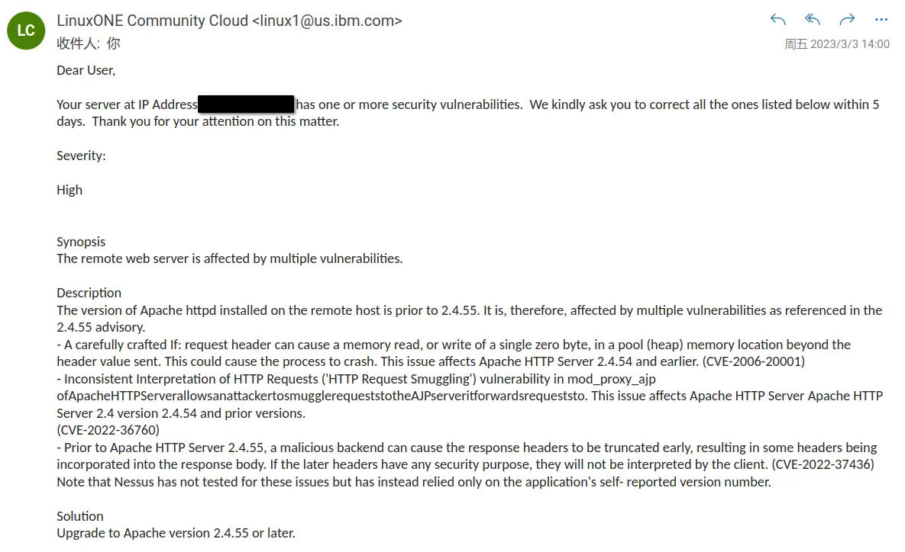
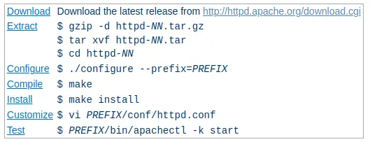

早上收到 linuxOne 的邮件：



一开始受宠若惊，毕竟这样就某个软件的漏洞专门发邮提醒的服务商不多见，仔细一看人家是 kindly ask you to correct all the ones listed below within 5 days......
好吧，那看来我不在 5 天内修复那我就要寄，白嫖党可没什么好硬气的，人家都警告的 Your access will be revoked for any non-compliance.

本来以为是 `apt update && apt upgrade` 一波，但是软件源里面的 apache 版本只到 2.4.52，只能自己编译安装了。

整个依赖链条是这样的：

```shell
            /----> PCRE2 (Perl Compatible Regular Expressions 2)
Apache2 ---|
            \----> Apache Portable Runtime (APR) ----> libxml2
```

所以需要单独编译安装它们。

一图以蔽之：



0. 首先：**卸载原来的 apache2**，使用 `sudo apt purge apache2 && sudo apt autoremove` 因为自己编译安装的 apache 不使用 /etc 里面的配置文件。

1. 安装编译器集合

    `sudo apt install build-essential`

2. 安装 `apr`

    ```bash
    git clone https://github.com/apache/apr
    cd apr
    ./buildconf
    ./configure --with-libxml2
    ```

    注意它需要 `libxml2` 但是软件源里面安装的 `libxml2-dev` 需要手动软链接一下：

    ```bash
    sudo ln -s /usr/include/libxml2/libxml /usr/include/libxml
    ```

    接下来再

    ```bash
    make -j8 && make install
    ```

3. 安装 `pcre`

    **替换为最新的版本！**

    ```bash
    wget https://github.com/PCRE2Project/pcre2/releases/download/pcre2-10.42/pcre2-10.42.tar.bz2
    tar -xvf pcre2-10.42.tar.bz2
    cd pcre2-10.42/
    ./configure
    make -j8
    sudo make install
    ```

4. 安装 `apache2`

    寻找最新的版本：[http://httpd.apache.org/download.cgi](http://httpd.apache.org/download.cgi)

    ```bash
    wget https://dlcdn.apache.org/httpd/httpd-2.4.55.tar.bz2
    tar -xvf httpd-2.4.55.tar.bz2 
    cd httpd-2.4.55/
    ./configure
    make -j8
    sudo make install
    ```

- 配置文件位置：`/usr/local/apache2/conf`
- 服务器控制：`/usr/local/apache2/bin/apachectl`

所以启动服务器：`/usr/local/apache2/bin/apachectl -k restart`

## 再次编译升级

在已安装服务器的构建目录中或旧安装的源代码树的根目录中找到文件 `config.nice`。然后，将 `config.nice` 文件复制到新版本的源代码树中，对其进行编辑以进行任何所需的更改，然后编译即可。


# 所以 IBM 为什么知道 Apache 的版本

`top` 一下，看见两个程序 `iucvconn` `iucvserv`，`strings` 之看见不少 `z/VM`，`Copyright IBM Corp` 之类的字符串，看来就是它没错了。

当然我还是不敢去掉它们，毕竟我也不知道这算不算 `non-compliance`（

# 后续

服务器被收回了，悲......

# 参考

- [Apache - Compiling and Installing](https://httpd.apache.org/docs/current/install.html)
- [pcre2build man page](http://pcre.org/current/doc/html/pcre2build.html)