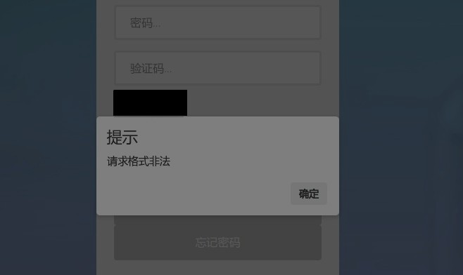
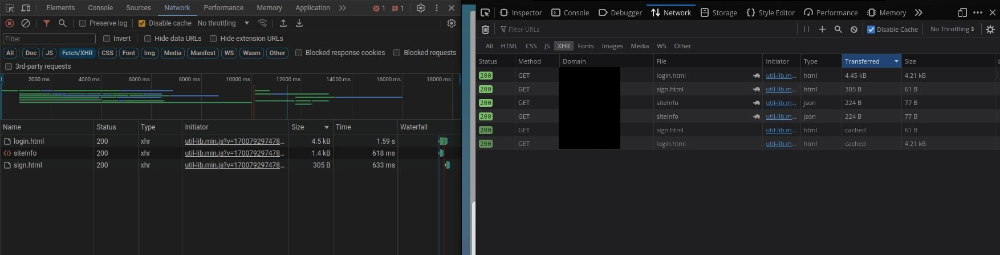
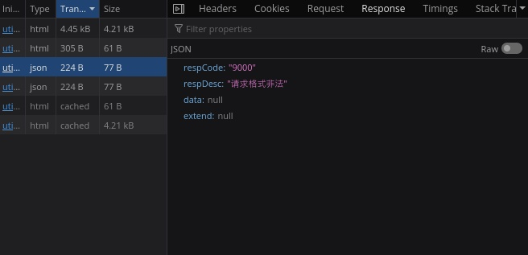
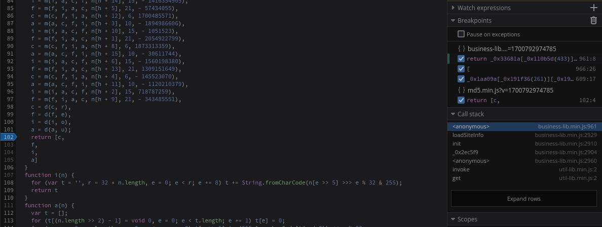
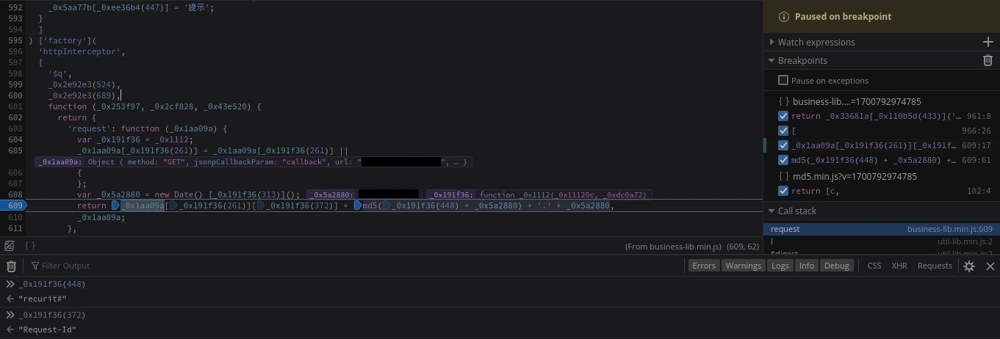
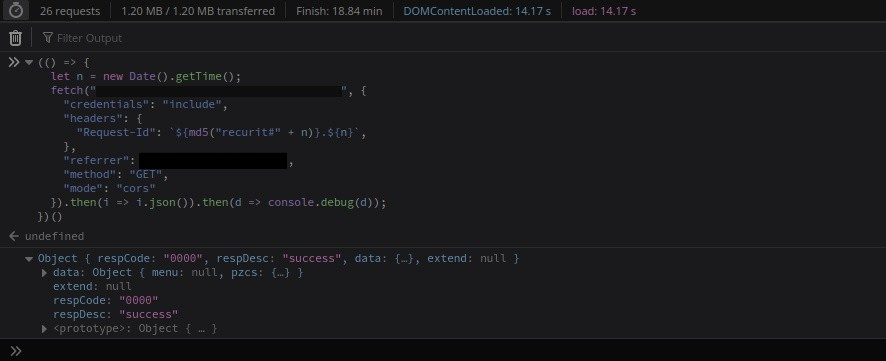

大概是两三年以前吧，我看到过一篇文章，讲的是一个系统管理员解决关于「电子邮件无法发送到 500 英里以外」的故事，这样的事情听起来蛮扯淡的，老实讲我觉得不太可能发生类似的事情，但谁知道呢，今天倒是我在这里写下这样有些好笑的事情了。

事情的起因是这样的，有个用户，在试图登录某个考试的报考站点时怎么也登录不上去：



考虑到这位用户的计算机水平不高，再加上政府网站的技术栈一般不那么时髦，首先要求的就是对方多换几个浏览器试试看，可 Chrome，Firefox 乃至 IE 都试了一圈，没有一个能用的，再让用户换个网络环境，还是不行，带网络的安全模式，依旧不行，打电话给网站客服，支支吾吾说不出什么来，真是见鬼，不得不自己试试看。

首先要做的就是复现这个问题，但很明显我不知道怎么做到，全局搜索「非法」或者「请求」也没有结果，它弹出的方法不是原生的 `alert`，不能搜索。看一眼脚本，不出意外是一坨混淆过的大便（居然用的是 Angular？）


我可不要（<del>不敢</del>）逆向这一团东西，所以想了想，把对面的请求日志和自己的比对了一下：



经过一番比对，发现了这个 `siteinfo` 的 `xhr` 请求，打开一看果然：



原来「请求非法」在这里！

那么下一步的问题就是，同一个请求，怎么在这边是合法，到对面就是非法，这很简单，使用简单的排除法，一个 GET 请求，没有 URL 参数，看一眼 Request Headers，除去通用的头，不同寻常的只有两个：`Cookie` 和 `Request-Id`，使用请求编辑工具，测试了一下，Cookie 内容无关紧要，无非是一些 Java Web 的 SESSIONID 之类的信息，对结果没有影响，但去掉 `Request-Id` 就会出错。

这么说，同一个页面，同一个脚本，在不同的电脑上会产生不一样的请求头？这不扯淡嘛。那么下一步的目标：找到是谁插入了这个标头。仔细看了一眼这个标头的内容：

```json
Request-Id: "1a7b76f5d825d3df7d280dde4ff7fd42.1699672291483"
```

格式是 `32 位 string + . + 数字` 的格式。后者一眼就能看出来是时间戳，前面的 32 位字符串，盲猜是某种 Hash，而请求的脚本中正好有一个叫作 `md5.min.js` 的，md5 的 hexdigest 正好是 32 位，那还用怎么说，找到这个脚本，打断点呗。



只要有用到这个函数的就断一下，虽然混淆的一塌糊涂，但总归能从调用栈中看到一些信息，果然：



```js
// 流程
const date = new Date().getTime();
return request.headers["Request-Id"] = md5("recurit#" + date) + '.' + date;
```

所以这个标头的内容就是 `md5("recurit#" + 时间戳) + '.' + 时间戳`，其中时间戳是 `new Date().getTime()`。使用 Python 计算一下，结果是相同的。此时我大概已经明白啥东西出问题了，毕竟这个标头里面只有一个变量，那么，如果和我的推测一致，我可以手动组一个请求，直接获取数据：



于是原因水落石出了：用户调了系统时间，比正常时间晚了五分钟，导致网页计算出来的 Request-Id **永远** 在服务器那边是五分钟之前的无效请求......

哈哈！
