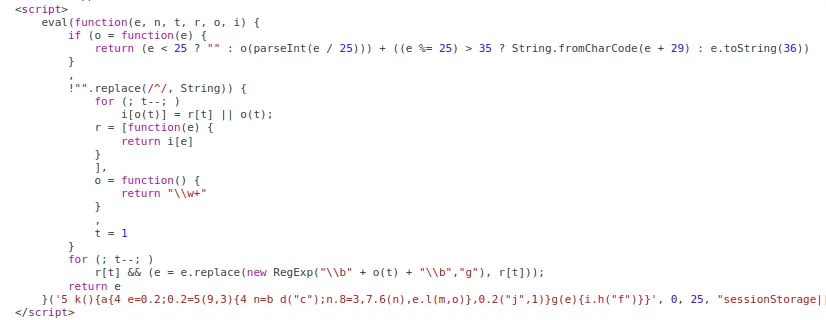
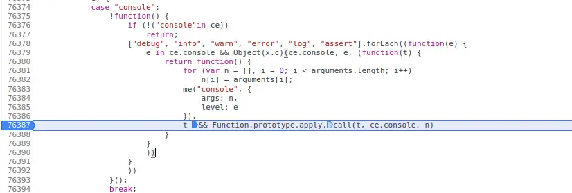
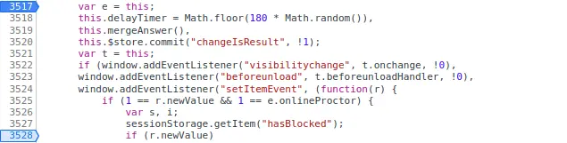
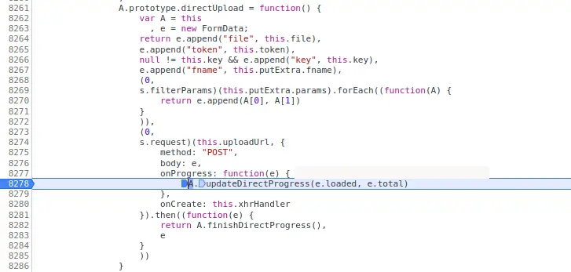

最近需要用到雨课堂来在线考试，向来讨厌这种考试方式，又听说它有截屏，切屏上报等等功能，正好有认识的老师愿意把他的帐号借给我，就简单分析了一下。

# 简介

雨课堂的网页端考试系统用的是 Vue 用到的框架/库有 Element UI, Sentry, MathJax, core-js, Clipboard.js ，存储采用自己 cdn + 阿里云 + 七牛云的混合存储，前端文件用 Webpack + Babel 打包，所有接口 API 地址都暴露在全局空间 `window.API` 中。判断浏览器环境采用 UA 字符串匹配，可以用虚假 UA 绕过，但会导致出现问题。每隔 3 分钟自动截取屏幕和摄像头上传。

# 各个功能分析

## 获取试卷内容

没有花里胡哨的加密，很朴实的获得试卷内容，并逐个放到 vuex store 里面，接着渲染。接口明确给出的，就是 `/exam_room/show_paper?exam_id=` ，你甚至可以重放 xhr (

当然，获取试卷内容需要一个名为 `x-access-token` 的 cookie，是一个 HS256 JWT Token，内容形式是

```typescript
{
  "uid": number,    // 用户 UID
  "eid": number,    // 试卷编号
  "cid": string,    // classroom_id，班级号
  "exp": number,    // 时间戳
  "ro": 0 | 1       // 是否是只读试卷
}
```

获取时只校验 token，不管 UA。这个 Token 在进入考试时获取，甚至没有设置 HttpOnly。

## 时间同步

每隔一段事件会和服务器同步数据，使用 setintervel + xhr 方式，防止通过修改本地事件作弊。

## 反调试

在整个 HTML 文档的开头，有检测是否有禁用切屏的代码，被 eval 混淆了。



**搞笑的是，雨课堂的前端似乎真的只是在网上[随便找了一个](https://www.sojson.com/js.html)「在线混淆工具」就拿来用了**，解密之：

```js
function getEventListeners() {
    try {
        var e = sessionStorage.setItem;
        sessionStorage.setItem = function(t, s) {
            var n = new Event("setItemEvent");
            n.newValue = s, window.dispatchEvent(n), e.apply(this, arguments)
        }, sessionStorage.setItem("hasBlocked", 1)
    } catch (e) {
        console.log("检测到切屏被屏蔽")
    }
}
```

可以看到这个函数的作用是把「sessionStorage.setItem」包装了一层，添加了一个新的「setItemEvent」事件。用来检查和反馈「检测到你已禁用切屏监测功能，该行为已记录并上报老师，请立即停止异常行为！」了。虽然十分的奇怪（

## 检测打开调试工具

如果学生打开控制台，会提示「检测到你已禁用切屏监测功能，该行为已记录并上报老师，请立即停止异常行为！」，这个提示只在 `getExamData` 的时候显示一次，之后不再重复显示。

检测的方法没有仔细探究，但注意到它覆盖了原来的 console.log 方法并包装了一层，以前看到过类似的检测思路，但似乎并不是[这样](https://juejin.cn/post/6844903857227726856)的方法。



## 切屏检测

使用的是非常常见的方法，即 `window.addEventListener("visibilitychange", callback)` 的方法。直接搜索就可以找到源码位置，打断点，看 call stack 保存一份引用，就能把 callback 去掉了。直接 `window.removeEventListener("visibilitychange", callback, !0)`。




另外，也可以直接拦截 addEventListener 的调用，很简单就能够阻止 callback 的绑定。

```js
(function() {
    const ___raw = window.addEventListener

    window.addEventListener = function (event, cb, options) {
        event === "visibilitychange" 
            ? console.log("Refused.") 
            : ___raw(event, cb, options);
    }
})();
```

## 自动截屏

雨课堂考试的监考，并不是实时传输屏幕的数据，而是每隔一段时间（一般是 3 分钟）截取一张样本上传，同时设置 sessionStorage 的 `captureTime` 项目保存时间戳。上传的目标服务器是根据地区选择的，都是七牛云的服务器。

```js
e.regionUphostMap = {
    z0: {
        srcUphost: "up.qiniup.com",
        cdnUphost: "upload.qiniup.com"
    },
    z1: {
        srcUphost: "up-z1.qiniup.com",
        cdnUphost: "upload-z1.qiniup.com"
    },
    z2: {
        srcUphost: "up-z2.qiniup.com",
        cdnUphost: "upload-z2.qiniup.com"
    },
    na0: {
        srcUphost: "up-na0.qiniup.com",
        cdnUphost: "upload-na0.qiniup.com"
    },
    as0: {
        srcUphost: "up-as0.qiniup.com",
        cdnUphost: "upload-as0.qiniup.com"
       }
}
```

## 数据上报

数据上报分两种，一种是常规数据的上报，也就是本地事件同步和间隔截屏的数据。第二种是检测到切屏，打开调试工具后的事件上报，通常还会顺便提交截屏作为「证据」。

第一种上报，就是 setintervel，使用了[七牛的官方 SDK](https://github.com/qiniu/js-sdk#usage)，retryCount 设置是 3 ，也就是最多尝试上传 3 次。整个流程先在雨课堂的 API 获取 token，再上传。



第二种是对于考试事件的检测和上报，和以前的版本不同，现在雨课堂不再使用单独的 API 地址来上报，而是使用和提交答案一样的 API，上报的内容依旧是 json 文本，格式如下：

```typescript
{
    action: number,
    exam_id: string,
    t: "t" | "f"
}
```

其中 `action` 即为事件的编号。切出当前页面是 12，切回则是 16。更新答案选择（即自动保存答案）使用同一个 API，但数据格式不同。

令人啧啧称奇的是，这个汇报情况的 API 没有速率限制，你可以用一个简单的脚本把自己的切屏次数刷到很离谱的数量。

## 水印

水印通过 CSS 背景图片实现，选择器为 `.el-color-predefine__color-selector.is-alpha`，base64 编码 png 格式。

# 绕过思路

如果你想硬核绕过，不是很难

- 对于切屏检测，直接把监听器移除。
- 对于文件上传，老方法，屏蔽七牛云的服务器即可。**但是这样一来，一开始上传证件照会失效**。
- 对于事件上传，大条的方法是用 uBlock 之类的工具屏蔽特定 xhr 请求，但是会影响自动答案保存。
- 如果你想要硬核的，proxy 劫持整个 XHR 对象原型，但是注意雨课堂已经用 `Sentry` 包装了一层。
- 对于水印，CSS 覆盖就完事了。
- 摄像头，可以使用 Chrome 的虚拟摄像头功能。

但是，如果你真的要和它对着干，不建议和它在同一个层次作战。更加稳妥的方法是使用虚拟机。


# 参考

- [文件伪装摄像头](/articles/Chrome文件伪装摄像头/index.html)
- [七牛 SDK ](https://github.com/qiniu/js-sdk#usage)
- [一个调试工具](https://github.com/ltgcgo/minuette)
- [Dynamic URL filtering](https://github.com/gorhill/uBlock/wiki/Dynamic-URL-filtering)
