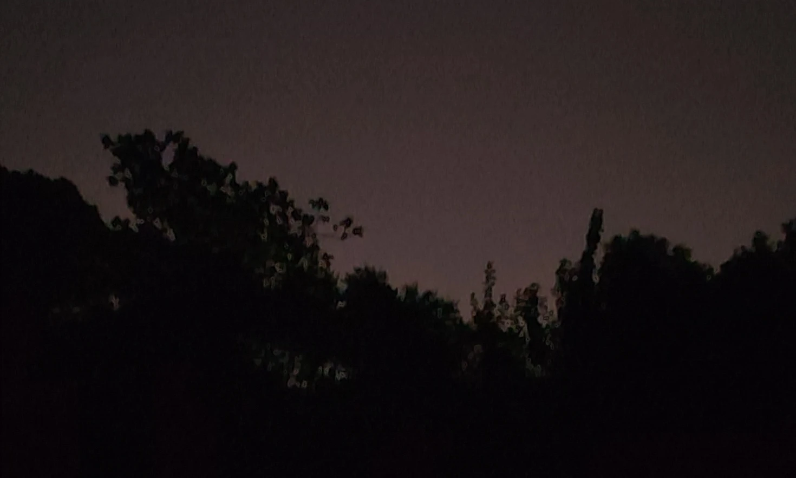

不知道是不是因为上半年特别离谱的[泄题和大量作弊](https://www.zhihu.com/question/603397178)，软考现在统一改成上机考试了。昨天去考软考中级的网络工程师，这里记录一下考试的经过。

## 考场环境

由于是第一次上机考试，谁也不懂它到底怎么考，虽然考前在官网上发了[模拟平台](https://bm.ruankao.org.cn/vexam/download/main)，但是这个模拟平台只是给你熟悉一下操作界面，具体流程还是不知道的。所以下午两点半的考试，我提前了大概一个半钟头就到了。

一开始我以为我走错了地方，因为考场附件几乎没几个人，直到马上要开始考试了，建筑物外也好准备室里面也好还是只有稀稀拉拉几个人。据监考人员说，缺考的也不少。想起之前考教师资格证时人挤人的场面，真是区别甚大。前来考试的人群也是很多元的，有大学生也有三四十岁的成年男女，想必是要考证升职加薪用。最年轻的不超过二十岁，安检时和监考交谈甚欢，年级大的大概五十几岁，头顶厚厚的一层岁月包浆。

考场就是一般的计算机教室，十一月份的大热天倒是很贴心的开了空调，但桌子并不是单独隔开的，每两个考生直接坐在一起，一眼就能瞟到同桌的显示器，不过既然是乱序，也就管不了那么多。

## 考试流程

原本的软考，是分上午下午两场的，现在改成机考，放在一起了。一场考试两个小时，还需要提前半小时进入考场，且每场考试只允许提前半小时交卷，满打满算做的再快也要在板凳上坐满三个半钟头，虽然节省了一顿午饭钱，屁股倒是有点发麻。

具体的来说是这样的，第一场考试两个钟头，可以提前半小时交卷，交完直接进入下一场，提前交卷多出来的时间可以继给下一场用，下一场同样是两个小时，提前半小时交卷，交完就可以走人了。当然，搞不懂也没关系，做完检查完就直接按「交卷」，如果可以那就直接到下一门，不行就再等等嘛。总的来说时间是绰绰有余的，足以在做完以后发呆很久（

## 考卷内容

我以为既然是机考那肯定不能带纸笔，事实上完全可以带一支笔，考场上会发草稿纸，不过最后要收回。然而我悲催的没有带笔，结果就免不了在脑中掰子网计算题了……

但其实也没关系，因为这个考试可以使用**计算器**，当然不是 Windows 的那个计算器，而是考试系统自己搓出来的计算器，拥有除了进制转换以外的所以常用功能。连着计算器还有一个记事本一样的文本框，算是「赛博草稿纸」。我还真用这俩玩意算出了所有计算题。

相比于第一门 75 道选择题，第二门综合运用就有点难度了，我旁边的那位仁兄对着屏幕直叹气，不过似乎试卷也不太一样？考前我也做过前几年的卷子，结合这一次的考试，我能感受到的趋势就是命令补全，选择填空之类的题目越来越少了，取代这些题目的是大型简答题，一个题目 4 分乃至 8 分，要求回答诸如「特点是什么」，「影响因素有哪些」这类题目，也有给出几张图，要求找出错误原因和解决方案的。对于后者，背命令不行了，横竖要上 eNSP 模拟，不然实在没感觉，至于前一种题型，一个大问按点得分，搞得像是在考政治或者语文，有些无语。

出考场已经是快六点了，天也暗了，考点附近还是只有稀稀拉拉几个人。天气预报有雨，风挺大，大概是要凉了吧。
